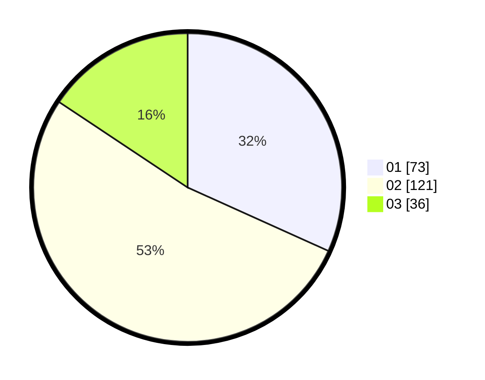

# Hasil

Hasil perolehan suara paslon dapat dilihat pada file paslon-01.txt, paslon-02.txt, dan paslon-03.txt.

Jika tidak ada, artinya data tersebut belum ada pada SIREKAP.

## Perolehan Suara

 * Paslon 01: **73**.
 * Paslon 02: **121**.
 * Paslon 03: **36**.

## Foto C Plano

https://sirekap-obj-formc.kpu.go.id/5f5d/pemilu/ppwp/31/72/06/10/03/3172061003018-20240216-210733--b64b30de-c305-40dc-808a-5ef75f514d44.jpg

https://sirekap-obj-formc.kpu.go.id/5f5d/pemilu/ppwp/31/72/06/10/03/3172061003018-20240216-210734--2650b294-15cd-428b-9544-ca4d77cd0f46.jpg

https://sirekap-obj-formc.kpu.go.id/5f5d/pemilu/ppwp/31/72/06/10/03/3172061003018-20240216-210733--5e8f7468-d203-4750-9a7a-0d15cd5bf0f9.jpg

## DATA PEMILIH TETAP

Jumlah pemilih dalam DPT: **283**.
 * L: **113**.
 * P: **170**.

## DATA PENGGUNA HAK PILIH

Jumlah pengguna hak pilih dalam DPT: **204**.
 * L: **78**.
 * P: **126**.

Jumlah pengguna hak pilih dalam DPTb: **22**.
 * L: **0**.
 * P: **22**.

Jumlah pengguna hak pilih dalam DPK: **7**.
 * L: **3**.
 * P: **4**.

Jumlah pengguna hak pilih: **233**.
 * L: **81**.
 * P: **152**.

## JUMLAH SUARA SAH DAN TIDAK SAH

JUMLAH SELURUH SUARA SAH: **230**.

JUMLAH SUARA TIDAK SAH: **2**.

JUMLAH SELURUH SUARA SAH DAN SUARA TIDAK SAH: **232**.
