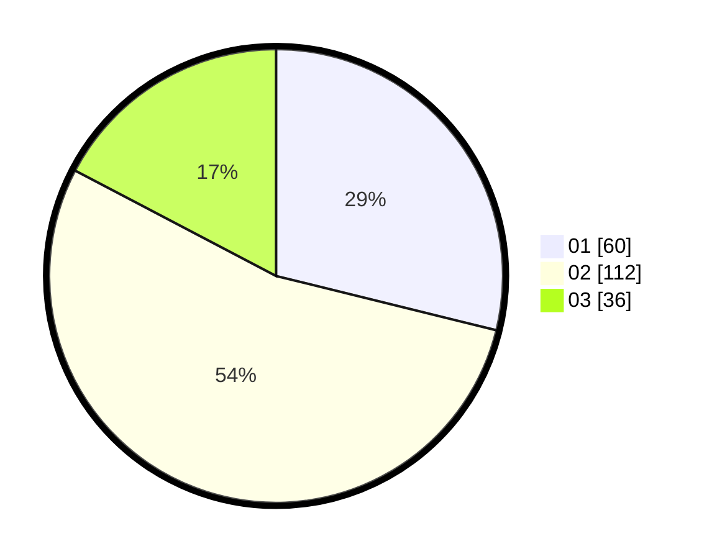

# Hasil

Hasil perolehan suara paslon dapat dilihat pada file paslon-01.txt, paslon-02.txt, dan paslon-03.txt.

Jika tidak ada, artinya data tersebut belum ada pada SIREKAP.

## Perolehan Suara

 * Paslon 01: **60**.
 * Paslon 02: **112**.
 * Paslon 03: **36**.

## Foto C Plano

https://sirekap-obj-formc.kpu.go.id/904d/pemilu/ppwp/31/72/06/10/03/3172061003021-20240219-161459--8ad40269-8877-47c6-8dd8-f5be922f93a6.jpg

https://sirekap-obj-formc.kpu.go.id/904d/pemilu/ppwp/31/72/06/10/03/3172061003021-20240219-161356--d1024b32-bda3-4e18-9fc2-802444632021.jpg

https://sirekap-obj-formc.kpu.go.id/904d/pemilu/ppwp/31/72/06/10/03/3172061003021-20240219-162321--335c9ae2-315f-47c0-b475-3d76322ba6a8.jpg

## DATA PEMILIH TETAP

Jumlah pemilih dalam DPT: **282**.
 * L: **118**.
 * P: **164**.

## DATA PENGGUNA HAK PILIH

Jumlah pengguna hak pilih dalam DPT: **206**.
 * L: **80**.
 * P: **126**.

Jumlah pengguna hak pilih dalam DPTb: **9**.
 * L: **4**.
 * P: **5**.

Jumlah pengguna hak pilih dalam DPK: **1**.
 * L: **1**.
 * P: **0**.

Jumlah pengguna hak pilih: **216**.
 * L: **85**.
 * P: **131**.

## JUMLAH SUARA SAH DAN TIDAK SAH

JUMLAH SELURUH SUARA SAH: **208**.

JUMLAH SUARA TIDAK SAH: **1**.

JUMLAH SELURUH SUARA SAH DAN SUARA TIDAK SAH: **209**.
