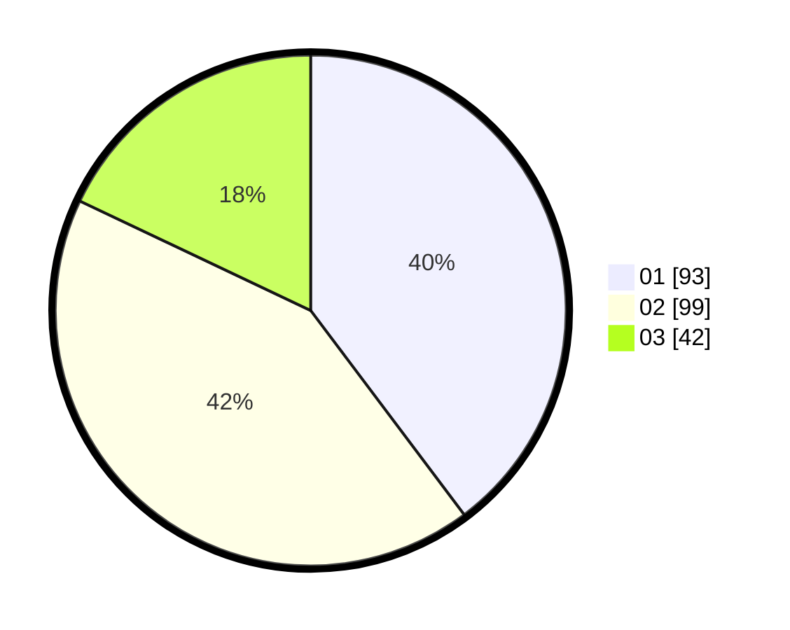

# Hasil

Hasil perolehan suara paslon dapat dilihat pada file paslon-01.txt, paslon-02.txt, dan paslon-03.txt.

Jika tidak ada, artinya data tersebut belum ada pada SIREKAP.

## Perolehan Suara

 * Paslon 01: **93**.
 * Paslon 02: **99**.
 * Paslon 03: **42**.

## Foto C Plano

https://sirekap-obj-formc.kpu.go.id/766a/pemilu/ppwp/31/72/06/10/03/3172061003022-20240215-235246--ab6485bb-2b89-409d-b9db-1803215e680f.jpg

https://sirekap-obj-formc.kpu.go.id/766a/pemilu/ppwp/31/72/06/10/03/3172061003022-20240216-002631--24b6ff4a-7bbf-4bd6-b119-5be568d5e242.jpg

https://sirekap-obj-formc.kpu.go.id/766a/pemilu/ppwp/31/72/06/10/03/3172061003022-20240215-030907--c2bc65b3-dd26-46eb-8d99-b5c4e6c6c656.jpg

## DATA PEMILIH TETAP

Jumlah pemilih dalam DPT: **289**.
 * L: **108**.
 * P: **181**.

## DATA PENGGUNA HAK PILIH

Jumlah pengguna hak pilih dalam DPT: **203**.
 * L: **78**.
 * P: **125**.

Jumlah pengguna hak pilih dalam DPTb: **22**.
 * L: **12**.
 * P: **10**.

Jumlah pengguna hak pilih dalam DPK: **3**.
 * L: **3**.
 * P: **0**.

Jumlah pengguna hak pilih: **228**.
 * L: **93**.
 * P: **135**.

## JUMLAH SUARA SAH DAN TIDAK SAH

JUMLAH SELURUH SUARA SAH: **234**.

JUMLAH SUARA TIDAK SAH: **4**.

JUMLAH SELURUH SUARA SAH DAN SUARA TIDAK SAH: **238**.
