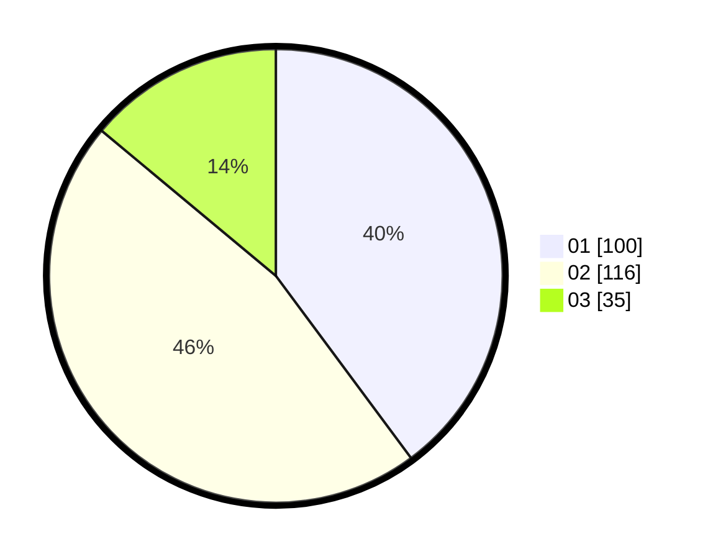

# Hasil

Hasil perolehan suara paslon dapat dilihat pada file paslon-01.txt, paslon-02.txt, dan paslon-03.txt.

Jika tidak ada, artinya data tersebut belum ada pada SIREKAP.

## Perolehan Suara

 * Paslon 01: **100**.
 * Paslon 02: **116**.
 * Paslon 03: **35**.

## Foto C Plano

https://sirekap-obj-formc.kpu.go.id/9eed/pemilu/ppwp/31/72/06/10/03/3172061003025-20240214-200731--cc6adbe8-b29d-4aac-8931-fbf49b2ad354.jpg

https://sirekap-obj-formc.kpu.go.id/9eed/pemilu/ppwp/31/72/06/10/03/3172061003025-20240214-204304--91d2d0bc-96e6-4451-9238-b3023b1b56be.jpg

https://sirekap-obj-formc.kpu.go.id/9eed/pemilu/ppwp/31/72/06/10/03/3172061003025-20240214-213455--d5c995cf-e9b6-485f-8db6-139d6f37ba0a.jpg
