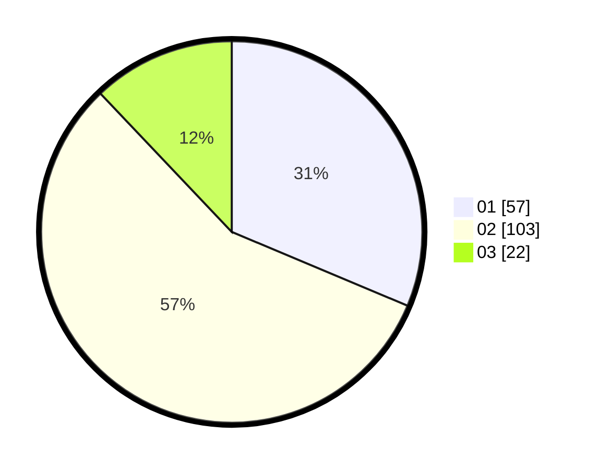

# Hasil

Hasil perolehan suara paslon dapat dilihat pada file paslon-01.txt, paslon-02.txt, dan paslon-03.txt.

Jika tidak ada, artinya data tersebut belum ada pada SIREKAP.

## Perolehan Suara

 * Paslon 01: **57**.
 * Paslon 02: **103**.
 * Paslon 03: **22**.

## Foto C Plano

https://sirekap-obj-formc.kpu.go.id/36d5/pemilu/ppwp/31/72/06/10/03/3172061003032-20240214-155809--1176504a-74d0-46b9-841a-7c740fa63be4.jpg

https://sirekap-obj-formc.kpu.go.id/36d5/pemilu/ppwp/31/72/06/10/03/3172061003032-20240214-155857--978936c9-4bfb-489f-99c0-79256bdecab8.jpg

https://sirekap-obj-formc.kpu.go.id/36d5/pemilu/ppwp/31/72/06/10/03/3172061003032-20240214-155926--ccddb32b-722e-4d6d-89ec-98dad005ca12.jpg

## DATA PEMILIH TETAP

Jumlah pemilih dalam DPT: **294**.
 * L: **158**.
 * P: **136**.

## DATA PENGGUNA HAK PILIH

Jumlah pengguna hak pilih dalam DPT: **185**.
 * L: **94**.
 * P: **91**.

Jumlah pengguna hak pilih dalam DPTb: **5**.
 * L: **5**.
 * P: **0**.

Jumlah pengguna hak pilih dalam DPK: **0**.
 * L: **0**.
 * P: **0**.

Jumlah pengguna hak pilih: **190**.
 * L: **99**.
 * P: **91**.

## JUMLAH SUARA SAH DAN TIDAK SAH

JUMLAH SELURUH SUARA SAH: **188**.

JUMLAH SUARA TIDAK SAH: **0**.

JUMLAH SELURUH SUARA SAH DAN SUARA TIDAK SAH: **190**.
