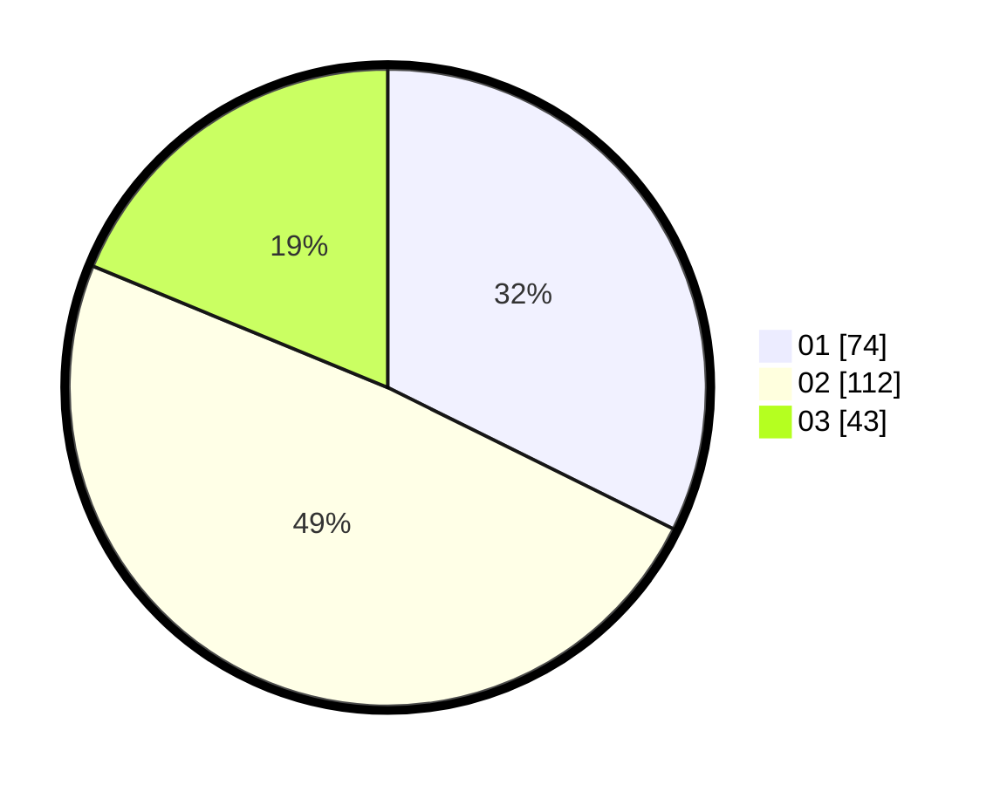

# Hasil

Hasil perolehan suara paslon dapat dilihat pada file paslon-01.txt, paslon-02.txt, dan paslon-03.txt.

Jika tidak ada, artinya data tersebut belum ada pada SIREKAP.

## Perolehan Suara

 * Paslon 01: **74**.
 * Paslon 02: **112**.
 * Paslon 03: **43**.

## Foto C Plano

https://sirekap-obj-formc.kpu.go.id/2b91/pemilu/ppwp/31/72/06/10/03/3172061003038-20240215-045946--dd223e14-cf88-41b6-bbb5-4a798592b5c3.jpg

https://sirekap-obj-formc.kpu.go.id/2b91/pemilu/ppwp/31/72/06/10/03/3172061003038-20240215-050221--116bfec7-e2d2-4ddf-8d6e-0f6d8cea9e85.jpg

https://sirekap-obj-formc.kpu.go.id/2b91/pemilu/ppwp/31/72/06/10/03/3172061003038-20240215-050434--6acaa272-3865-40f9-af27-29087e3ec4be.jpg

## DATA PEMILIH TETAP

Jumlah pemilih dalam DPT: **215**.
 * L: **90**.
 * P: **125**.

## DATA PENGGUNA HAK PILIH

Jumlah pengguna hak pilih dalam DPT: **215**.
 * L: **90**.
 * P: **125**.

Jumlah pengguna hak pilih dalam DPTb: **14**.
 * L: **4**.
 * P: **10**.

Jumlah pengguna hak pilih dalam DPK: **1**.
 * L: **0**.
 * P: **1**.

Jumlah pengguna hak pilih: **230**.
 * L: **94**.
 * P: **136**.

## JUMLAH SUARA SAH DAN TIDAK SAH

JUMLAH SELURUH SUARA SAH: **229**.

JUMLAH SUARA TIDAK SAH: **1**.

JUMLAH SELURUH SUARA SAH DAN SUARA TIDAK SAH: **230**.
