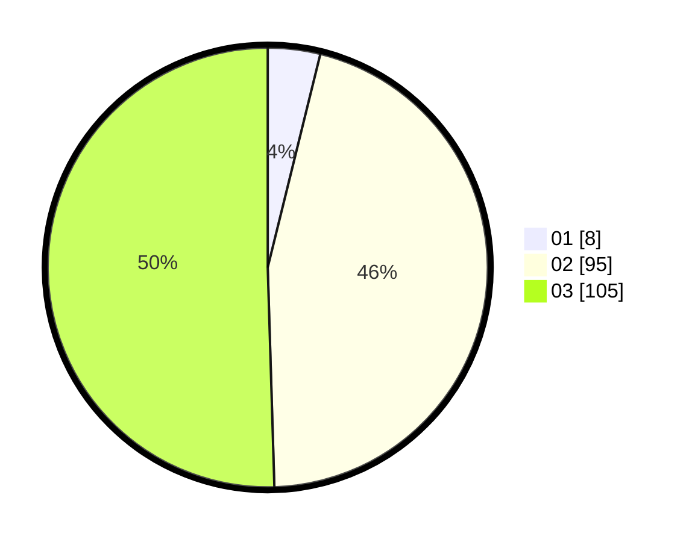

# Hasil

Hasil perolehan suara paslon dapat dilihat pada file paslon-01.txt, paslon-02.txt, dan paslon-03.txt.

Jika tidak ada, artinya data tersebut belum ada pada SIREKAP.

## Perolehan Suara

 * Paslon 01: **8**.
 * Paslon 02: **95**.
 * Paslon 03: **105**.

## Foto C Plano

https://sirekap-obj-formc.kpu.go.id/dc08/pemilu/ppwp/31/72/06/10/03/3172061003040-20240214-201134--f0046105-5c8b-42d7-84af-5c78e505fcfb.jpg

https://sirekap-obj-formc.kpu.go.id/dc08/pemilu/ppwp/31/72/06/10/03/3172061003040-20240214-200949--0e1fa354-03ef-4393-9bb1-5d535d18ac08.jpg

https://sirekap-obj-formc.kpu.go.id/dc08/pemilu/ppwp/31/72/06/10/03/3172061003040-20240214-201057--1df6c88e-882a-4440-8c82-c171b0e4483c.jpg

## DATA PEMILIH TETAP

Jumlah pemilih dalam DPT: **292**.
 * L: **139**.
 * P: **153**.

## DATA PENGGUNA HAK PILIH

Jumlah pengguna hak pilih dalam DPT: **184**.
 * L: **89**.
 * P: **95**.

Jumlah pengguna hak pilih dalam DPTb: **22**.
 * L: **7**.
 * P: **15**.

Jumlah pengguna hak pilih dalam DPK: **2**.
 * L: **0**.
 * P: **2**.

Jumlah pengguna hak pilih: **208**.
 * L: **96**.
 * P: **112**.

## JUMLAH SUARA SAH DAN TIDAK SAH

JUMLAH SELURUH SUARA SAH: **208**.

JUMLAH SUARA TIDAK SAH: **0**.

JUMLAH SELURUH SUARA SAH DAN SUARA TIDAK SAH: **208**.
