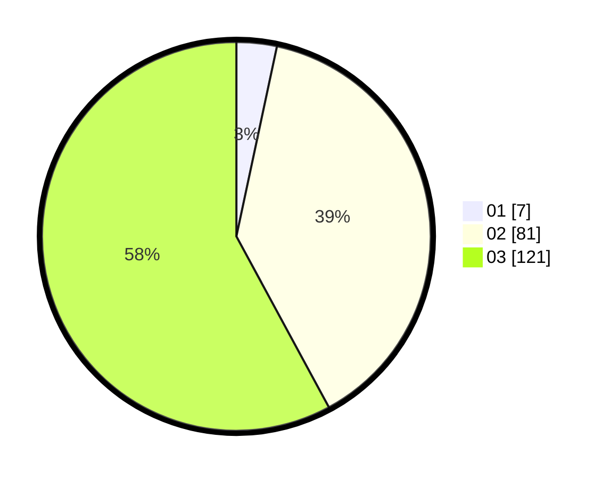

# Hasil

Hasil perolehan suara paslon dapat dilihat pada file paslon-01.txt, paslon-02.txt, dan paslon-03.txt.

Jika tidak ada, artinya data tersebut belum ada pada SIREKAP.

## Perolehan Suara

 * Paslon 01: **7**.
 * Paslon 02: **81**.
 * Paslon 03: **121**.

## Foto C Plano

https://sirekap-obj-formc.kpu.go.id/b6c0/pemilu/ppwp/31/72/06/10/03/3172061003044-20240219-135111--36a9e6bf-cdba-44b4-94c3-1e2dd45f46e7.jpg

https://sirekap-obj-formc.kpu.go.id/b6c0/pemilu/ppwp/31/72/06/10/03/3172061003044-20240219-135113--5b3f9a4f-878a-40e5-ba2d-6cd623a2f60c.jpg

https://sirekap-obj-formc.kpu.go.id/b6c0/pemilu/ppwp/31/72/06/10/03/3172061003044-20240219-135112--42f08457-0197-40a6-a80d-f135c07760d9.jpg

## DATA PEMILIH TETAP

Jumlah pemilih dalam DPT: **290**.
 * L: **140**.
 * P: **150**.

## DATA PENGGUNA HAK PILIH

Jumlah pengguna hak pilih dalam DPT: **186**.
 * L: **89**.
 * P: **97**.

Jumlah pengguna hak pilih dalam DPTb: **19**.
 * L: **9**.
 * P: **10**.

Jumlah pengguna hak pilih dalam DPK: **6**.
 * L: **2**.
 * P: **4**.

Jumlah pengguna hak pilih: **211**.
 * L: **100**.
 * P: **111**.

## JUMLAH SUARA SAH DAN TIDAK SAH

JUMLAH SELURUH SUARA SAH: **209**.

JUMLAH SUARA TIDAK SAH: **2**.

JUMLAH SELURUH SUARA SAH DAN SUARA TIDAK SAH: **211**.
