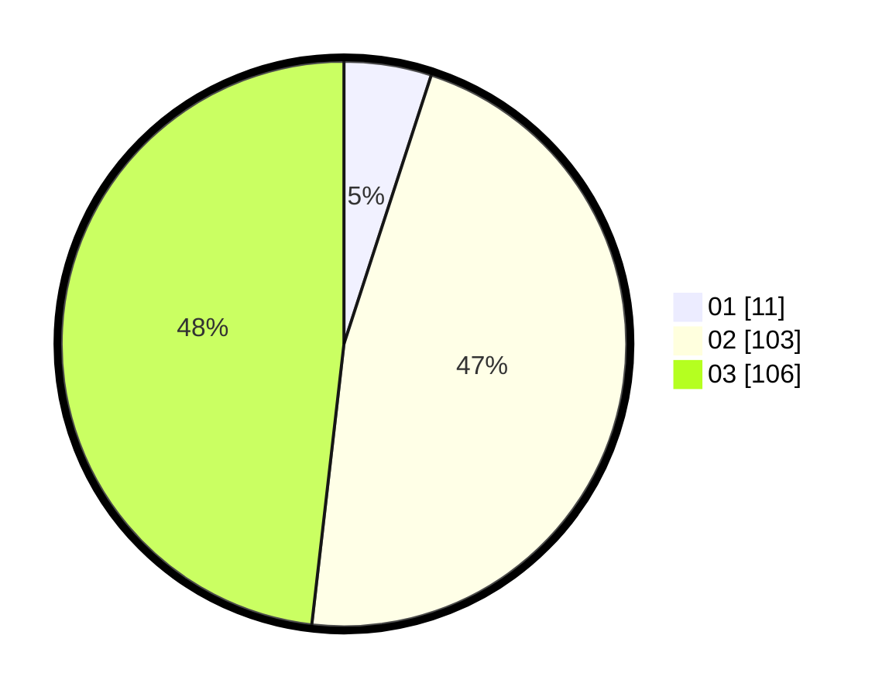

# Hasil

Hasil perolehan suara paslon dapat dilihat pada file paslon-01.txt, paslon-02.txt, dan paslon-03.txt.

Jika tidak ada, artinya data tersebut belum ada pada SIREKAP.

## Perolehan Suara

 * Paslon 01: **11**.
 * Paslon 02: **103**.
 * Paslon 03: **106**.

## Foto C Plano

https://sirekap-obj-formc.kpu.go.id/2898/pemilu/ppwp/31/72/06/10/03/3172061003046-20240214-155053--d5df719c-b4c4-41c0-b342-1f3516d59601.jpg

https://sirekap-obj-formc.kpu.go.id/2898/pemilu/ppwp/31/72/06/10/03/3172061003046-20240214-155013--08f8abb0-310e-4958-8031-7a0cff6fa6f6.jpg

https://sirekap-obj-formc.kpu.go.id/2898/pemilu/ppwp/31/72/06/10/03/3172061003046-20240214-155023--1e16b7fb-78ce-4cbe-88a6-68d0f854a52c.jpg

## DATA PEMILIH TETAP

Jumlah pemilih dalam DPT: **293**.
 * L: **142**.
 * P: **151**.

## DATA PENGGUNA HAK PILIH

Jumlah pengguna hak pilih dalam DPT: **202**.
 * L: **99**.
 * P: **103**.

Jumlah pengguna hak pilih dalam DPTb: **15**.
 * L: **6**.
 * P: **9**.

Jumlah pengguna hak pilih dalam DPK: **5**.
 * L: **2**.
 * P: **3**.

Jumlah pengguna hak pilih: **222**.
 * L: **107**.
 * P: **115**.

## JUMLAH SUARA SAH DAN TIDAK SAH

JUMLAH SELURUH SUARA SAH: **220**.

JUMLAH SUARA TIDAK SAH: **2**.

JUMLAH SELURUH SUARA SAH DAN SUARA TIDAK SAH: **222**.
