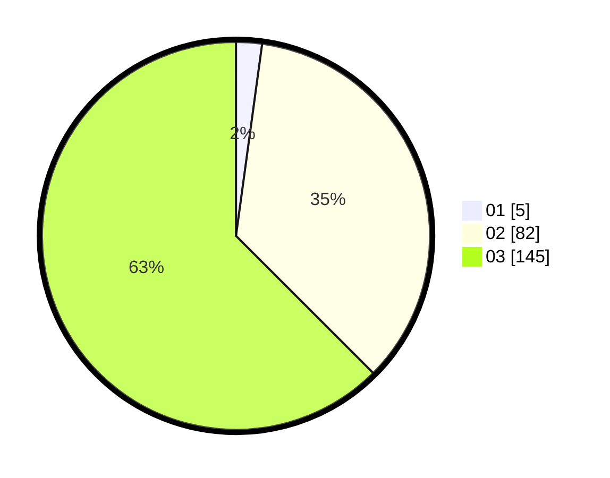

# Hasil

Hasil perolehan suara paslon dapat dilihat pada file paslon-01.txt, paslon-02.txt, dan paslon-03.txt.

Jika tidak ada, artinya data tersebut belum ada pada SIREKAP.

## Perolehan Suara

 * Paslon 01: **5**.
 * Paslon 02: **82**.
 * Paslon 03: **145**.

## Foto C Plano

https://sirekap-obj-formc.kpu.go.id/f9ab/pemilu/ppwp/31/72/06/10/03/3172061003047-20240215-190355--553e9056-87d1-44c6-b761-c9e9e46023ea.jpg

https://sirekap-obj-formc.kpu.go.id/f9ab/pemilu/ppwp/31/72/06/10/03/3172061003047-20240215-190414--6f3b4d4a-83d1-49d4-a7ac-8f42c09af530.jpg

https://sirekap-obj-formc.kpu.go.id/f9ab/pemilu/ppwp/31/72/06/10/03/3172061003047-20240215-190428--0bef233f-6be3-4eea-9281-4eeea57d1d27.jpg

## DATA PEMILIH TETAP

Jumlah pemilih dalam DPT: **283**.
 * L: **128**.
 * P: **155**.

## DATA PENGGUNA HAK PILIH

Jumlah pengguna hak pilih dalam DPT: **208**.
 * L: **96**.
 * P: **112**.

Jumlah pengguna hak pilih dalam DPTb: **24**.
 * L: **9**.
 * P: **15**.

Jumlah pengguna hak pilih dalam DPK: **5**.
 * L: **2**.
 * P: **3**.

Jumlah pengguna hak pilih: **237**.
 * L: **107**.
 * P: **130**.

## JUMLAH SUARA SAH DAN TIDAK SAH

JUMLAH SELURUH SUARA SAH: **232**.

JUMLAH SUARA TIDAK SAH: **5**.

JUMLAH SELURUH SUARA SAH DAN SUARA TIDAK SAH: **237**.
