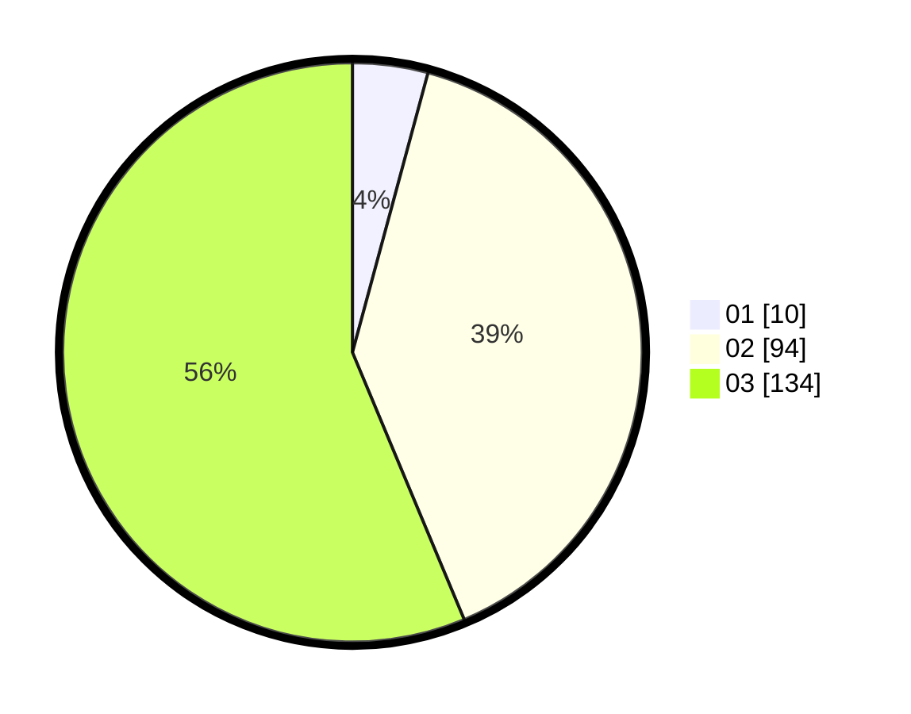

# Hasil

Hasil perolehan suara paslon dapat dilihat pada file paslon-01.txt, paslon-02.txt, dan paslon-03.txt.

Jika tidak ada, artinya data tersebut belum ada pada SIREKAP.

## Perolehan Suara

 * Paslon 01: **10**.
 * Paslon 02: **94**.
 * Paslon 03: **134**.

## Foto C Plano

https://sirekap-obj-formc.kpu.go.id/c5c0/pemilu/ppwp/31/72/06/10/03/3172061003054-20240214-155514--e859846a-744f-4abd-8909-448eb5e9dffe.jpg

https://sirekap-obj-formc.kpu.go.id/c5c0/pemilu/ppwp/31/72/06/10/03/3172061003054-20240214-155607--069d53c4-3750-4618-bfae-fb32a336d88c.jpg

https://sirekap-obj-formc.kpu.go.id/c5c0/pemilu/ppwp/31/72/06/10/03/3172061003054-20240214-155921--c07c2e78-1602-4663-b265-ca409049f8b8.jpg

## DATA PEMILIH TETAP

Jumlah pemilih dalam DPT: **285**.
 * L: **144**.
 * P: **141**.

## DATA PENGGUNA HAK PILIH

Jumlah pengguna hak pilih dalam DPT: **208**.
 * L: **106**.
 * P: **102**.

Jumlah pengguna hak pilih dalam DPTb: **22**.
 * L: **7**.
 * P: **15**.

Jumlah pengguna hak pilih dalam DPK: **8**.
 * L: **4**.
 * P: **4**.

Jumlah pengguna hak pilih: **238**.
 * L: **117**.
 * P: **121**.

## JUMLAH SUARA SAH DAN TIDAK SAH

JUMLAH SELURUH SUARA SAH: **238**.

JUMLAH SUARA TIDAK SAH: **1**.

JUMLAH SELURUH SUARA SAH DAN SUARA TIDAK SAH: **239**.
