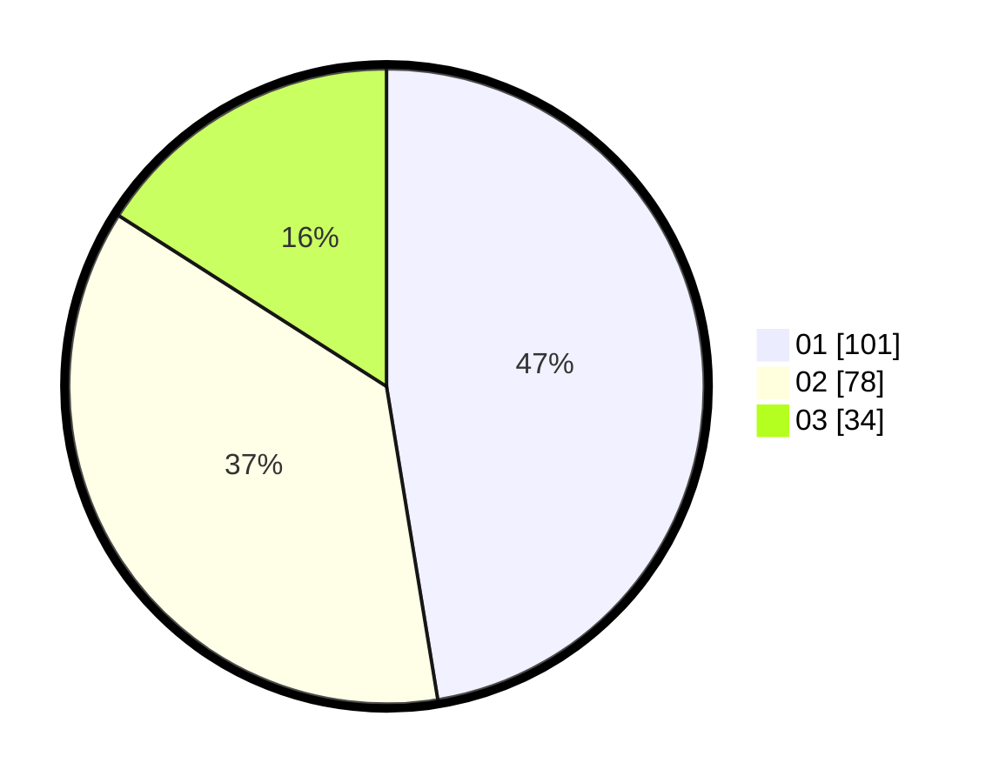

# Hasil

Hasil perolehan suara paslon dapat dilihat pada file paslon-01.txt, paslon-02.txt, dan paslon-03.txt.

Jika tidak ada, artinya data tersebut belum ada pada SIREKAP.

## Perolehan Suara

 * Paslon 01: **101**.
 * Paslon 02: **78**.
 * Paslon 03: **34**.

## Foto C Plano

https://sirekap-obj-formc.kpu.go.id/2c40/pemilu/ppwp/31/72/06/10/03/3172061003068-20240217-114627--6a190f0b-8c57-4752-b913-cd58f91704e7.jpg

https://sirekap-obj-formc.kpu.go.id/2c40/pemilu/ppwp/31/72/06/10/03/3172061003068-20240217-114629--06424097-c472-4cd5-8e07-8e179be15bb7.jpg

https://sirekap-obj-formc.kpu.go.id/2c40/pemilu/ppwp/31/72/06/10/03/3172061003068-20240217-114628--843c218b-cf6a-407d-825c-68260897bd11.jpg

## DATA PEMILIH TETAP

Jumlah pemilih dalam DPT: **295**.
 * L: **137**.
 * P: **158**.

## DATA PENGGUNA HAK PILIH

Jumlah pengguna hak pilih dalam DPT: **200**.
 * L: **86**.
 * P: **114**.

Jumlah pengguna hak pilih dalam DPTb: **11**.
 * L: **3**.
 * P: **8**.

Jumlah pengguna hak pilih dalam DPK: **4**.
 * L: **4**.
 * P: **0**.

Jumlah pengguna hak pilih: **215**.
 * L: **93**.
 * P: **122**.

## JUMLAH SUARA SAH DAN TIDAK SAH

JUMLAH SELURUH SUARA SAH: **213**.

JUMLAH SUARA TIDAK SAH: **3**.

JUMLAH SELURUH SUARA SAH DAN SUARA TIDAK SAH: **216**.
