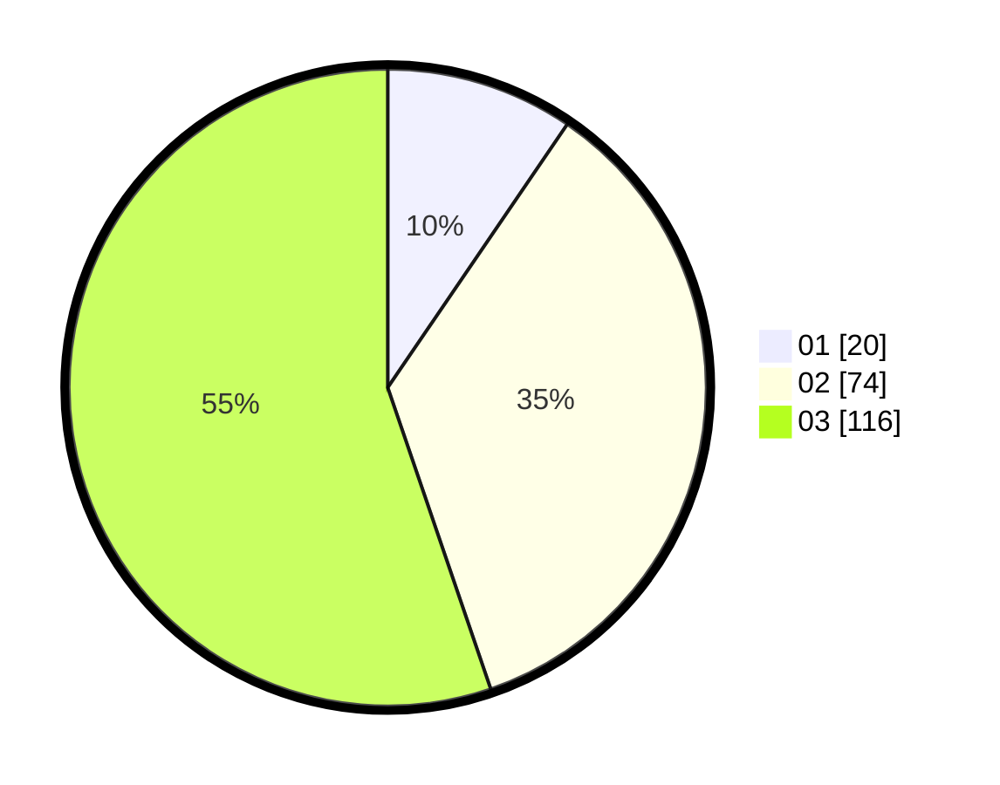

# Hasil

Hasil perolehan suara paslon dapat dilihat pada file paslon-01.txt, paslon-02.txt, dan paslon-03.txt.

Jika tidak ada, artinya data tersebut belum ada pada SIREKAP.

## Perolehan Suara

 * Paslon 01: **20**.
 * Paslon 02: **74**.
 * Paslon 03: **116**.

## Foto C Plano

https://sirekap-obj-formc.kpu.go.id/bcae/pemilu/ppwp/31/72/06/10/03/3172061003071-20240214-195246--b4e0b728-0104-4bec-9953-fb91eca46f5b.jpg

https://sirekap-obj-formc.kpu.go.id/bcae/pemilu/ppwp/31/72/06/10/03/3172061003071-20240214-214646--8477541b-c2ae-4e25-8beb-94c8f9d5bae7.jpg

https://sirekap-obj-formc.kpu.go.id/bcae/pemilu/ppwp/31/72/06/10/03/3172061003071-20240214-202421--ab063447-a61a-4f87-9d88-ea33748215ca.jpg

## DATA PEMILIH TETAP

Jumlah pemilih dalam DPT: **296**.
 * L: **132**.
 * P: **164**.

## DATA PENGGUNA HAK PILIH

Jumlah pengguna hak pilih dalam DPT: **205**.
 * L: **95**.
 * P: **110**.

Jumlah pengguna hak pilih dalam DPTb: **9**.
 * L: **9**.
 * P: **0**.

Jumlah pengguna hak pilih dalam DPK: **1**.
 * L: **1**.
 * P: **0**.

Jumlah pengguna hak pilih: **215**.
 * L: **105**.
 * P: **110**.

## JUMLAH SUARA SAH DAN TIDAK SAH

JUMLAH SELURUH SUARA SAH: **210**.

JUMLAH SUARA TIDAK SAH: **5**.

JUMLAH SELURUH SUARA SAH DAN SUARA TIDAK SAH: **215**.
