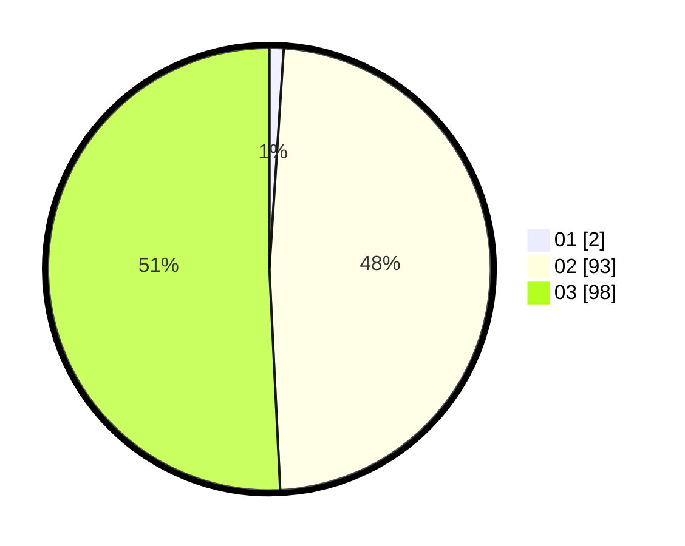

# Hasil

Hasil perolehan suara paslon dapat dilihat pada file paslon-01.txt, paslon-02.txt, dan paslon-03.txt.

Jika tidak ada, artinya data tersebut belum ada pada SIREKAP.

## Perolehan Suara

 * Paslon 01: **2**.
 * Paslon 02: **93**.
 * Paslon 03: **98**.

## Foto C Plano

https://sirekap-obj-formc.kpu.go.id/4434/pemilu/ppwp/31/72/06/10/03/3172061003075-20240219-103351--7f0bb1e4-3918-4454-9c0f-725562a9dd94.jpg

https://sirekap-obj-formc.kpu.go.id/4434/pemilu/ppwp/31/72/06/10/03/3172061003075-20240219-103353--e4a3660e-36e1-4273-926b-25c7a678ed25.jpg

https://sirekap-obj-formc.kpu.go.id/4434/pemilu/ppwp/31/72/06/10/03/3172061003075-20240219-103352--cb343483-6001-4ee6-bc90-93a70802ca21.jpg

## DATA PEMILIH TETAP

Jumlah pemilih dalam DPT: **277**.
 * L: **128**.
 * P: **149**.

## DATA PENGGUNA HAK PILIH

Jumlah pengguna hak pilih dalam DPT: **172**.
 * L: **74**.
 * P: **98**.

Jumlah pengguna hak pilih dalam DPTb: **8**.
 * L: **4**.
 * P: **4**.

Jumlah pengguna hak pilih dalam DPK: **17**.
 * L: **5**.
 * P: **12**.

Jumlah pengguna hak pilih: **197**.
 * L: **83**.
 * P: **114**.

## JUMLAH SUARA SAH DAN TIDAK SAH

JUMLAH SELURUH SUARA SAH: **193**.

JUMLAH SUARA TIDAK SAH: **4**.

JUMLAH SELURUH SUARA SAH DAN SUARA TIDAK SAH: **197**.
