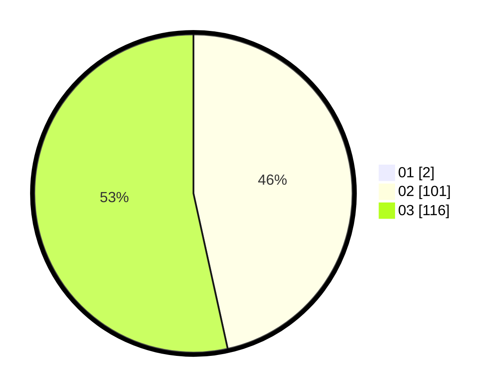

# Hasil

Hasil perolehan suara paslon dapat dilihat pada file paslon-01.txt, paslon-02.txt, dan paslon-03.txt.

Jika tidak ada, artinya data tersebut belum ada pada SIREKAP.

## Perolehan Suara

 * Paslon 01: **2**.
 * Paslon 02: **101**.
 * Paslon 03: **116**.

## Foto C Plano

https://sirekap-obj-formc.kpu.go.id/be3a/pemilu/ppwp/31/72/06/10/03/3172061003076-20240216-205922--45b5b5ba-89d2-4cd7-9065-93904c7dfb59.jpg

https://sirekap-obj-formc.kpu.go.id/be3a/pemilu/ppwp/31/72/06/10/03/3172061003076-20240216-101510--f6694944-f70e-439d-be4e-05d10131df8c.jpg

https://sirekap-obj-formc.kpu.go.id/be3a/pemilu/ppwp/31/72/06/10/03/3172061003076-20240216-205923--2f838c19-b1e7-4788-9baf-35bfc2235026.jpg

## DATA PEMILIH TETAP

Jumlah pemilih dalam DPT: **283**.
 * L: **143**.
 * P: **140**.

## DATA PENGGUNA HAK PILIH

Jumlah pengguna hak pilih dalam DPT: **204**.
 * L: **100**.
 * P: **104**.

Jumlah pengguna hak pilih dalam DPTb: **7**.
 * L: **2**.
 * P: **5**.

Jumlah pengguna hak pilih dalam DPK: **9**.
 * L: **7**.
 * P: **2**.

Jumlah pengguna hak pilih: **220**.
 * L: **109**.
 * P: **111**.

## JUMLAH SUARA SAH DAN TIDAK SAH

JUMLAH SELURUH SUARA SAH: **219**.

JUMLAH SUARA TIDAK SAH: **1**.

JUMLAH SELURUH SUARA SAH DAN SUARA TIDAK SAH: **220**.
