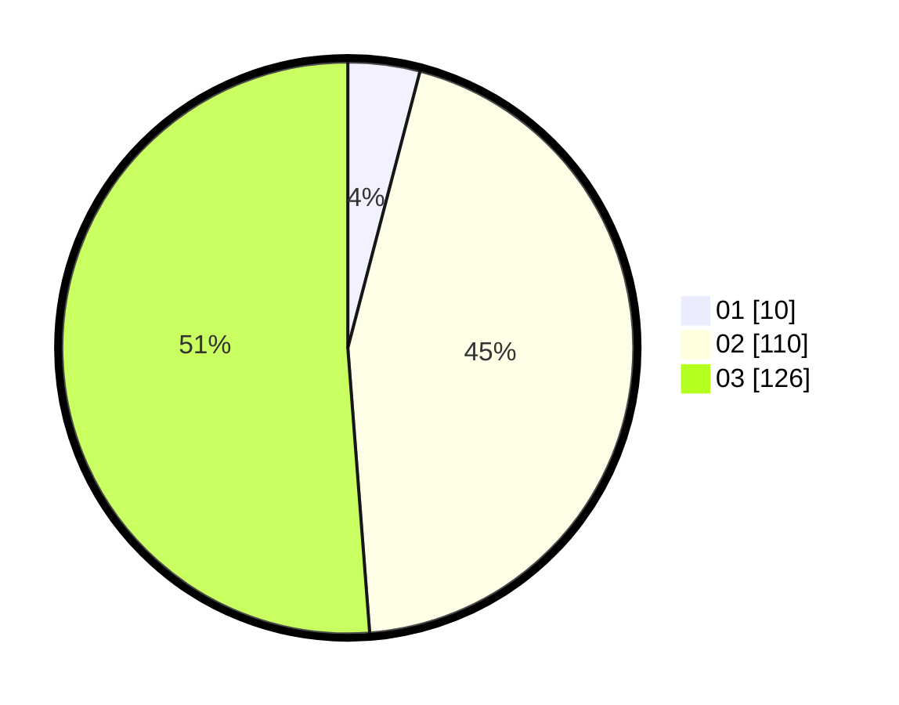

# Hasil

Hasil perolehan suara paslon dapat dilihat pada file paslon-01.txt, paslon-02.txt, dan paslon-03.txt.

Jika tidak ada, artinya data tersebut belum ada pada SIREKAP.

## Perolehan Suara

 * Paslon 01: **10**.
 * Paslon 02: **110**.
 * Paslon 03: **126**.

## Foto C Plano

https://sirekap-obj-formc.kpu.go.id/9d57/pemilu/ppwp/31/72/06/10/03/3172061003085-20240214-155255--20cb99ff-cd0a-4642-b57b-590c378a33a7.jpg

https://sirekap-obj-formc.kpu.go.id/9d57/pemilu/ppwp/31/72/06/10/03/3172061003085-20240214-155322--521c35fc-9f62-4b28-b397-ecda1d5eb242.jpg

https://sirekap-obj-formc.kpu.go.id/9d57/pemilu/ppwp/31/72/06/10/03/3172061003085-20240214-155347--2615d3e5-4acd-43ba-82eb-190f93b0a2a9.jpg

## DATA PEMILIH TETAP

Jumlah pemilih dalam DPT: **288**.
 * L: **133**.
 * P: **155**.

## DATA PENGGUNA HAK PILIH

Jumlah pengguna hak pilih dalam DPT: **213**.
 * L: **103**.
 * P: **110**.

Jumlah pengguna hak pilih dalam DPTb: **20**.
 * L: **8**.
 * P: **12**.

Jumlah pengguna hak pilih dalam DPK: **13**.
 * L: **5**.
 * P: **8**.

Jumlah pengguna hak pilih: **246**.
 * L: **116**.
 * P: **130**.

## JUMLAH SUARA SAH DAN TIDAK SAH

JUMLAH SELURUH SUARA SAH: **246**.

JUMLAH SUARA TIDAK SAH: **0**.

JUMLAH SELURUH SUARA SAH DAN SUARA TIDAK SAH: **246**.
