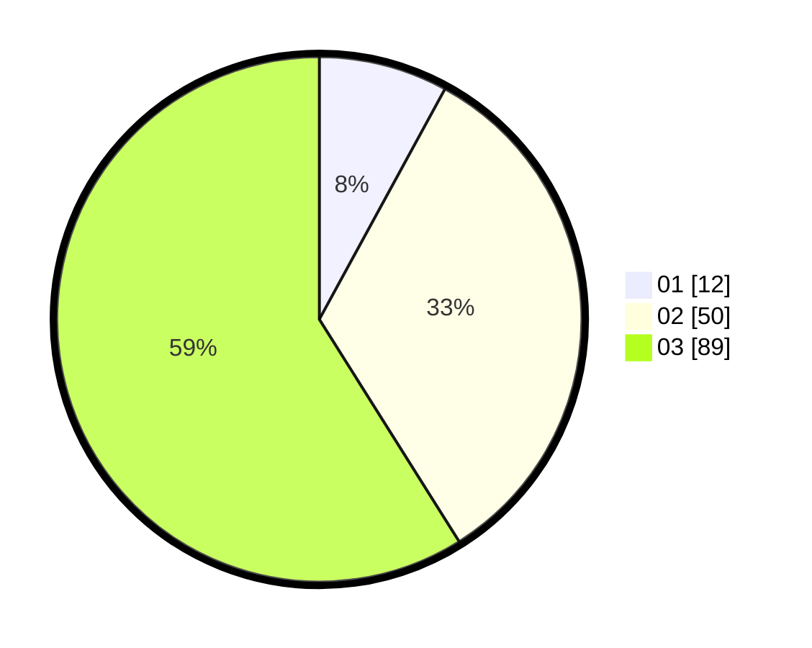

# Hasil

Hasil perolehan suara paslon dapat dilihat pada file paslon-01.txt, paslon-02.txt, dan paslon-03.txt.

Jika tidak ada, artinya data tersebut belum ada pada SIREKAP.

## Perolehan Suara

 * Paslon 01: **12**.
 * Paslon 02: **50**.
 * Paslon 03: **89**.

## Foto C Plano

https://sirekap-obj-formc.kpu.go.id/9d05/pemilu/ppwp/31/72/06/10/03/3172061003086-20240214-195230--1c808a4d-2ed2-4aac-bad3-3cb784f13c0f.jpg

https://sirekap-obj-formc.kpu.go.id/9d05/pemilu/ppwp/31/72/06/10/03/3172061003086-20240214-195422--ef0baace-b84a-42ce-9437-8dabe7cb0e1c.jpg

https://sirekap-obj-formc.kpu.go.id/9d05/pemilu/ppwp/31/72/06/10/03/3172061003086-20240214-195510--cfc67ad4-5e74-4cd9-a674-ec90d5cee5e6.jpg

## DATA PEMILIH TETAP

Jumlah pemilih dalam DPT: **170**.
 * L: **85**.
 * P: **85**.

## DATA PENGGUNA HAK PILIH

Jumlah pengguna hak pilih dalam DPT: **134**.
 * L: **71**.
 * P: **63**.

Jumlah pengguna hak pilih dalam DPTb: **15**.
 * L: **7**.
 * P: **8**.

Jumlah pengguna hak pilih dalam DPK: **4**.
 * L: **2**.
 * P: **2**.

Jumlah pengguna hak pilih: **153**.
 * L: **80**.
 * P: **73**.

## JUMLAH SUARA SAH DAN TIDAK SAH

JUMLAH SELURUH SUARA SAH: **151**.

JUMLAH SUARA TIDAK SAH: **2**.

JUMLAH SELURUH SUARA SAH DAN SUARA TIDAK SAH: **153**.
