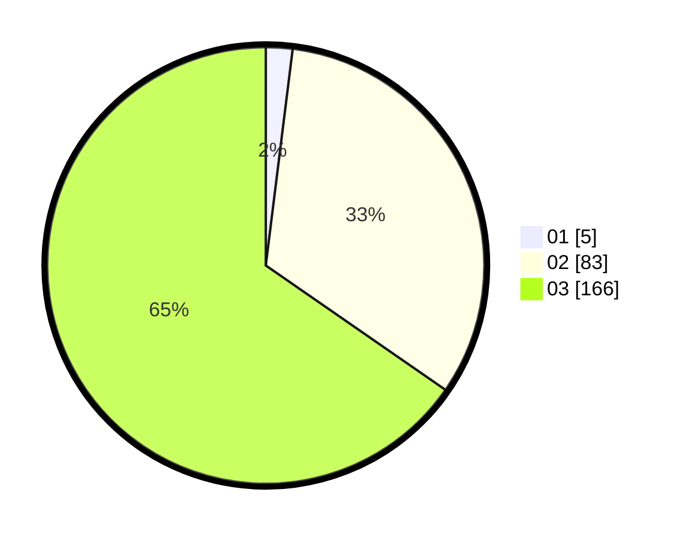

# Hasil

Hasil perolehan suara paslon dapat dilihat pada file paslon-01.txt, paslon-02.txt, dan paslon-03.txt.

Jika tidak ada, artinya data tersebut belum ada pada SIREKAP.

## Perolehan Suara

 * Paslon 01: **5**.
 * Paslon 02: **83**.
 * Paslon 03: **166**.

## Foto C Plano

https://sirekap-obj-formc.kpu.go.id/c4f4/pemilu/ppwp/31/72/06/10/03/3172061003087-20240217-111624--9a2716ed-d00d-4f87-866a-82786a794613.jpg

https://sirekap-obj-formc.kpu.go.id/c4f4/pemilu/ppwp/31/72/06/10/03/3172061003087-20240217-111625--49718750-6c75-406a-9972-55dc42640034.jpg

https://sirekap-obj-formc.kpu.go.id/c4f4/pemilu/ppwp/31/72/06/10/03/3172061003087-20240217-111624--132e6b06-97de-4f3d-97fb-b5a65007ae8f.jpg

## DATA PEMILIH TETAP

Jumlah pemilih dalam DPT: **295**.
 * L: **145**.
 * P: **150**.

## DATA PENGGUNA HAK PILIH

Jumlah pengguna hak pilih dalam DPT: **215**.
 * L: **106**.
 * P: **109**.

Jumlah pengguna hak pilih dalam DPTb: **25**.
 * L: **8**.
 * P: **17**.

Jumlah pengguna hak pilih dalam DPK: **16**.
 * L: **7**.
 * P: **9**.

Jumlah pengguna hak pilih: **256**.
 * L: **121**.
 * P: **135**.

## JUMLAH SUARA SAH DAN TIDAK SAH

JUMLAH SELURUH SUARA SAH: **254**.

JUMLAH SUARA TIDAK SAH: **2**.

JUMLAH SELURUH SUARA SAH DAN SUARA TIDAK SAH: **256**.
