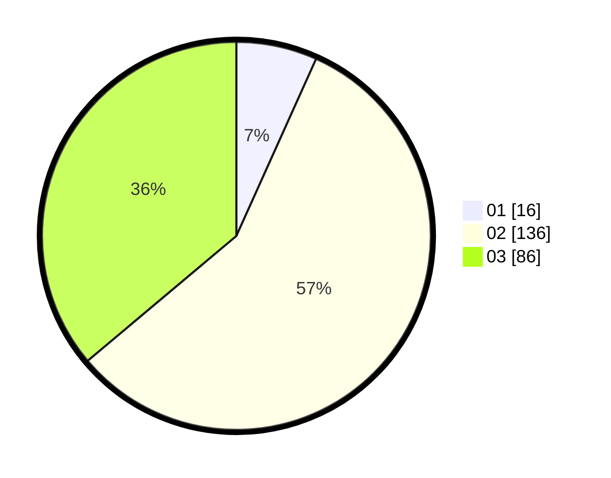

# Hasil

Hasil perolehan suara paslon dapat dilihat pada file paslon-01.txt, paslon-02.txt, dan paslon-03.txt.

Jika tidak ada, artinya data tersebut belum ada pada SIREKAP.

## Perolehan Suara

 * Paslon 01: **16**.
 * Paslon 02: **136**.
 * Paslon 03: **86**.

## Foto C Plano

https://sirekap-obj-formc.kpu.go.id/be51/pemilu/ppwp/31/72/06/10/03/3172061003095-20240216-171504--1b6f11b8-b1e2-44b3-9709-8780fba71e5a.jpg

https://sirekap-obj-formc.kpu.go.id/be51/pemilu/ppwp/31/72/06/10/03/3172061003095-20240216-171506--9c1400f8-92a7-4076-83cf-b28fa88bd7b8.jpg

https://sirekap-obj-formc.kpu.go.id/be51/pemilu/ppwp/31/72/06/10/03/3172061003095-20240216-171505--7d79ff99-b5cf-46cb-89de-13354115923d.jpg

## DATA PEMILIH TETAP

Jumlah pemilih dalam DPT: **238**.
 * L: **103**.
 * P: **135**.

## DATA PENGGUNA HAK PILIH

Jumlah pengguna hak pilih dalam DPT: **212**.
 * L: **92**.
 * P: **120**.

Jumlah pengguna hak pilih dalam DPTb: **16**.
 * L: **7**.
 * P: **9**.

Jumlah pengguna hak pilih dalam DPK: **10**.
 * L: **4**.
 * P: **6**.

Jumlah pengguna hak pilih: **238**.
 * L: **103**.
 * P: **135**.

## JUMLAH SUARA SAH DAN TIDAK SAH

JUMLAH SELURUH SUARA SAH: **238**.

JUMLAH SUARA TIDAK SAH: **0**.

JUMLAH SELURUH SUARA SAH DAN SUARA TIDAK SAH: **238**.
