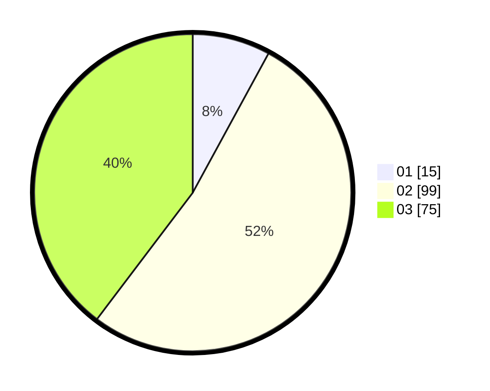

# Hasil

Hasil perolehan suara paslon dapat dilihat pada file paslon-01.txt, paslon-02.txt, dan paslon-03.txt.

Jika tidak ada, artinya data tersebut belum ada pada SIREKAP.

## Perolehan Suara

 * Paslon 01: **15**.
 * Paslon 02: **99**.
 * Paslon 03: **75**.

## Foto C Plano

https://sirekap-obj-formc.kpu.go.id/3641/pemilu/ppwp/31/72/06/10/03/3172061003101-20240214-225133--02502093-022b-4e98-89f4-27d0743a73be.jpg

https://sirekap-obj-formc.kpu.go.id/3641/pemilu/ppwp/31/72/06/10/03/3172061003101-20240214-215942--9661067a-1ed8-42e2-beca-683640da8c27.jpg

https://sirekap-obj-formc.kpu.go.id/3641/pemilu/ppwp/31/72/06/10/03/3172061003101-20240214-205908--a0a4fe5c-a59f-4aab-bd72-4717c8eb9bad.jpg

## DATA PEMILIH TETAP

Jumlah pemilih dalam DPT: **259**.
 * L: **115**.
 * P: **144**.

## DATA PENGGUNA HAK PILIH

Jumlah pengguna hak pilih dalam DPT: **171**.
 * L: **81**.
 * P: **90**.

Jumlah pengguna hak pilih dalam DPTb: **14**.
 * L: **10**.
 * P: **4**.

Jumlah pengguna hak pilih dalam DPK: **5**.
 * L: **0**.
 * P: **5**.

Jumlah pengguna hak pilih: **190**.
 * L: **91**.
 * P: **99**.

## JUMLAH SUARA SAH DAN TIDAK SAH

JUMLAH SELURUH SUARA SAH: **189**.

JUMLAH SUARA TIDAK SAH: **1**.

JUMLAH SELURUH SUARA SAH DAN SUARA TIDAK SAH: **190**.
