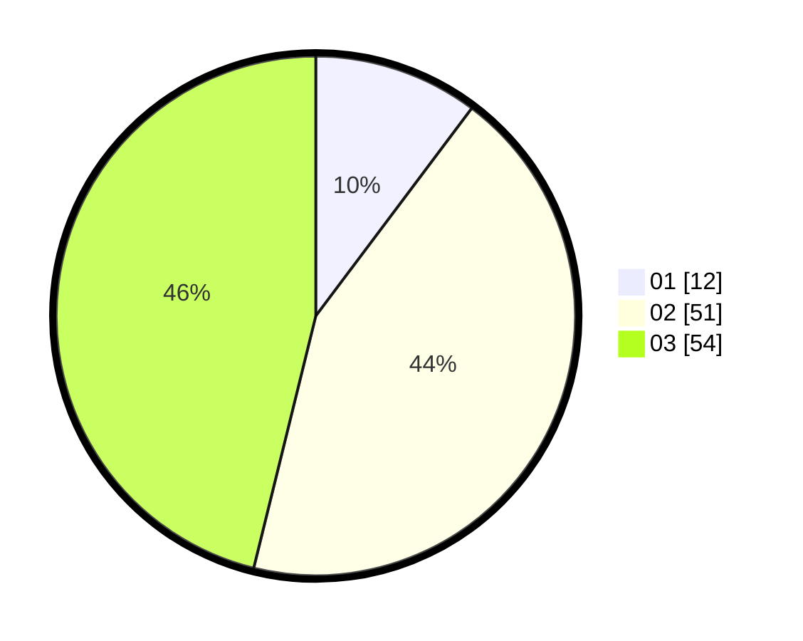

# Hasil

Hasil perolehan suara paslon dapat dilihat pada file paslon-01.txt, paslon-02.txt, dan paslon-03.txt.

Jika tidak ada, artinya data tersebut belum ada pada SIREKAP.

## Perolehan Suara

 * Paslon 01: **12**.
 * Paslon 02: **51**.
 * Paslon 03: **54**.

## Foto C Plano

https://sirekap-obj-formc.kpu.go.id/0d65/pemilu/ppwp/31/72/06/10/03/3172061003102-20240219-183453--442e5c5b-17ed-46d3-b1e5-b173d733036e.jpg

https://sirekap-obj-formc.kpu.go.id/0d65/pemilu/ppwp/31/72/06/10/03/3172061003102-20240219-183455--394faaea-b8ef-4ae7-aa91-5a6d6d6c0802.jpg

https://sirekap-obj-formc.kpu.go.id/0d65/pemilu/ppwp/31/72/06/10/03/3172061003102-20240219-183454--3264fd78-4a68-44fb-9f60-1e80eaeea0b6.jpg

## DATA PEMILIH TETAP

Jumlah pemilih dalam DPT: **102**.
 * L: **44**.
 * P: **58**.

## DATA PENGGUNA HAK PILIH

Jumlah pengguna hak pilih dalam DPT: **102**.
 * L: **44**.
 * P: **58**.

Jumlah pengguna hak pilih dalam DPTb: **13**.
 * L: **5**.
 * P: **8**.

Jumlah pengguna hak pilih dalam DPK: **3**.
 * L: **0**.
 * P: **3**.

Jumlah pengguna hak pilih: **118**.
 * L: **49**.
 * P: **69**.

## JUMLAH SUARA SAH DAN TIDAK SAH

JUMLAH SELURUH SUARA SAH: **117**.

JUMLAH SUARA TIDAK SAH: **1**.

JUMLAH SELURUH SUARA SAH DAN SUARA TIDAK SAH: **118**.
