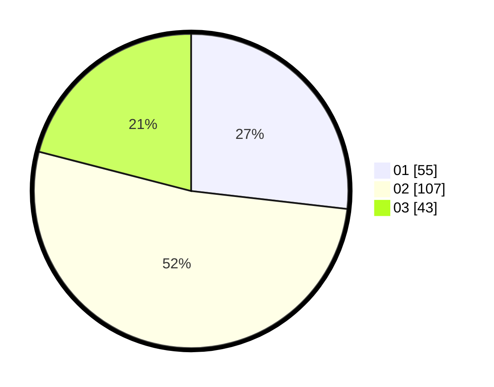

# Hasil

Hasil perolehan suara paslon dapat dilihat pada file paslon-01.txt, paslon-02.txt, dan paslon-03.txt.

Jika tidak ada, artinya data tersebut belum ada pada SIREKAP.

## Perolehan Suara

 * Paslon 01: **55**.
 * Paslon 02: **107**.
 * Paslon 03: **43**.

## Foto C Plano

https://sirekap-obj-formc.kpu.go.id/0f3f/pemilu/ppwp/31/72/06/10/03/3172061003105-20240214-230055--9f7ecffe-ebfb-43ea-a0b5-9f6f80f2564f.jpg

https://sirekap-obj-formc.kpu.go.id/0f3f/pemilu/ppwp/31/72/06/10/03/3172061003105-20240214-230159--e2c8ffe7-f1db-41c4-a313-9972c4cd95f2.jpg

https://sirekap-obj-formc.kpu.go.id/0f3f/pemilu/ppwp/31/72/06/10/03/3172061003105-20240214-230247--75d469b5-e606-47eb-93c6-306170ec1a18.jpg

## DATA PEMILIH TETAP

Jumlah pemilih dalam DPT: **236**.
 * L: **148**.
 * P: **133**.

## DATA PENGGUNA HAK PILIH

Jumlah pengguna hak pilih dalam DPT: **286**.
 * L: **148**.
 * P: **138**.

Jumlah pengguna hak pilih dalam DPTb: **16**.
 * L: **6**.
 * P: **10**.

Jumlah pengguna hak pilih dalam DPK: **6**.
 * L: **4**.
 * P: **2**.

Jumlah pengguna hak pilih: **308**.
 * L: **158**.
 * P: **150**.

## JUMLAH SUARA SAH DAN TIDAK SAH

JUMLAH SELURUH SUARA SAH: **205**.

JUMLAH SUARA TIDAK SAH: **1**.

JUMLAH SELURUH SUARA SAH DAN SUARA TIDAK SAH: **206**.
