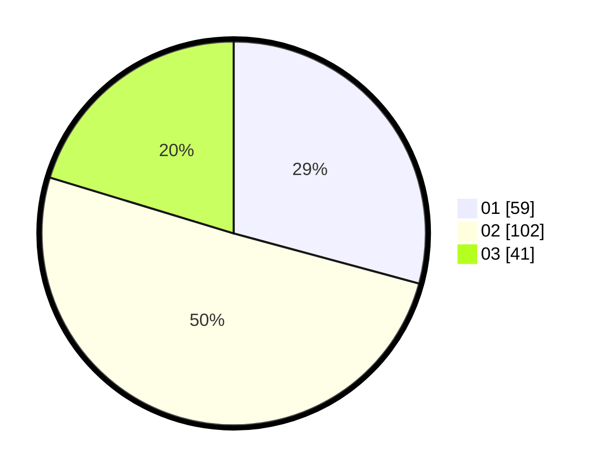

# Hasil

Hasil perolehan suara paslon dapat dilihat pada file paslon-01.txt, paslon-02.txt, dan paslon-03.txt.

Jika tidak ada, artinya data tersebut belum ada pada SIREKAP.

## Perolehan Suara

 * Paslon 01: **59**.
 * Paslon 02: **102**.
 * Paslon 03: **41**.

## Foto C Plano

https://sirekap-obj-formc.kpu.go.id/552b/pemilu/ppwp/31/72/06/10/03/3172061003111-20240216-211837--3e5733fb-a67a-4eae-91f2-59525c4dac96.jpg

https://sirekap-obj-formc.kpu.go.id/552b/pemilu/ppwp/31/72/06/10/03/3172061003111-20240216-211051--30e9dbf5-242b-4d79-9412-7ea78b21e980.jpg

https://sirekap-obj-formc.kpu.go.id/552b/pemilu/ppwp/31/72/06/10/03/3172061003111-20240216-211129--3b3b509c-d3f7-49d9-8566-a707d18763ee.jpg

## DATA PEMILIH TETAP

Jumlah pemilih dalam DPT: **284**.
 * L: **149**.
 * P: **135**.

## DATA PENGGUNA HAK PILIH

Jumlah pengguna hak pilih dalam DPT: **188**.
 * L: **94**.
 * P: **94**.

Jumlah pengguna hak pilih dalam DPTb: **14**.
 * L: **11**.
 * P: **3**.

Jumlah pengguna hak pilih dalam DPK: **0**.
 * L: **0**.
 * P: **0**.

Jumlah pengguna hak pilih: **202**.
 * L: **105**.
 * P: **97**.

## JUMLAH SUARA SAH DAN TIDAK SAH

JUMLAH SELURUH SUARA SAH: **202**.

JUMLAH SUARA TIDAK SAH: **2**.

JUMLAH SELURUH SUARA SAH DAN SUARA TIDAK SAH: **204**.
