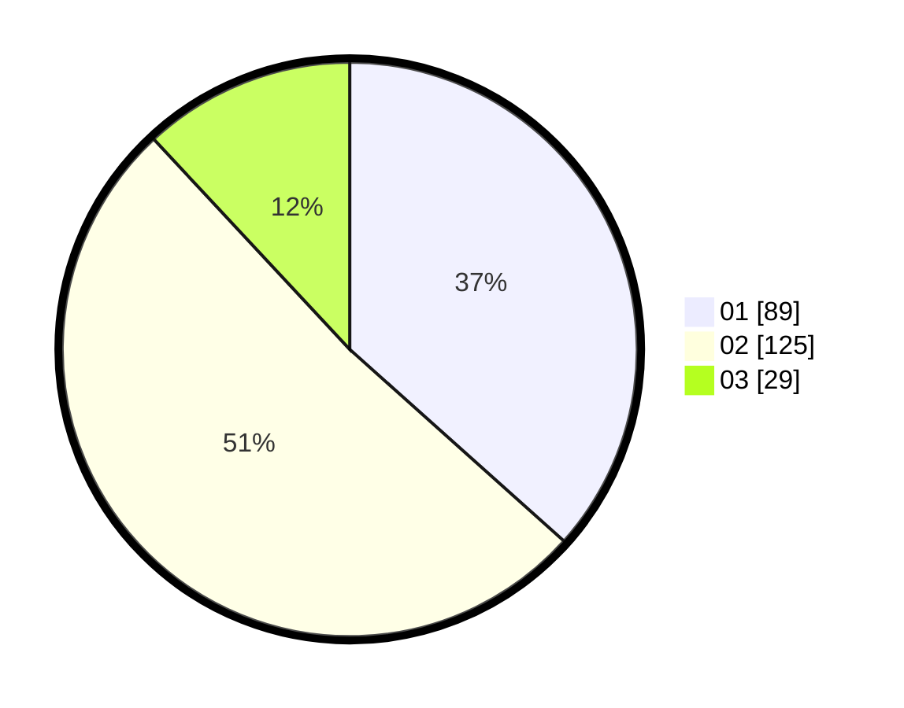

# Hasil

Hasil perolehan suara paslon dapat dilihat pada file paslon-01.txt, paslon-02.txt, dan paslon-03.txt.

Jika tidak ada, artinya data tersebut belum ada pada SIREKAP.

## Perolehan Suara

 * Paslon 01: **89**.
 * Paslon 02: **125**.
 * Paslon 03: **29**.

## Foto C Plano

https://sirekap-obj-formc.kpu.go.id/1c8b/pemilu/ppwp/31/72/06/10/03/3172061003114-20240214-191916--35c80d0d-db3c-4b3a-aac1-47824ed17579.jpg

https://sirekap-obj-formc.kpu.go.id/1c8b/pemilu/ppwp/31/72/06/10/03/3172061003114-20240214-191931--3cc93fc7-07a6-4006-a982-d6829da1c782.jpg

https://sirekap-obj-formc.kpu.go.id/1c8b/pemilu/ppwp/31/72/06/10/03/3172061003114-20240214-235328--af06e663-7974-42cd-bf25-50674f675ac1.jpg
