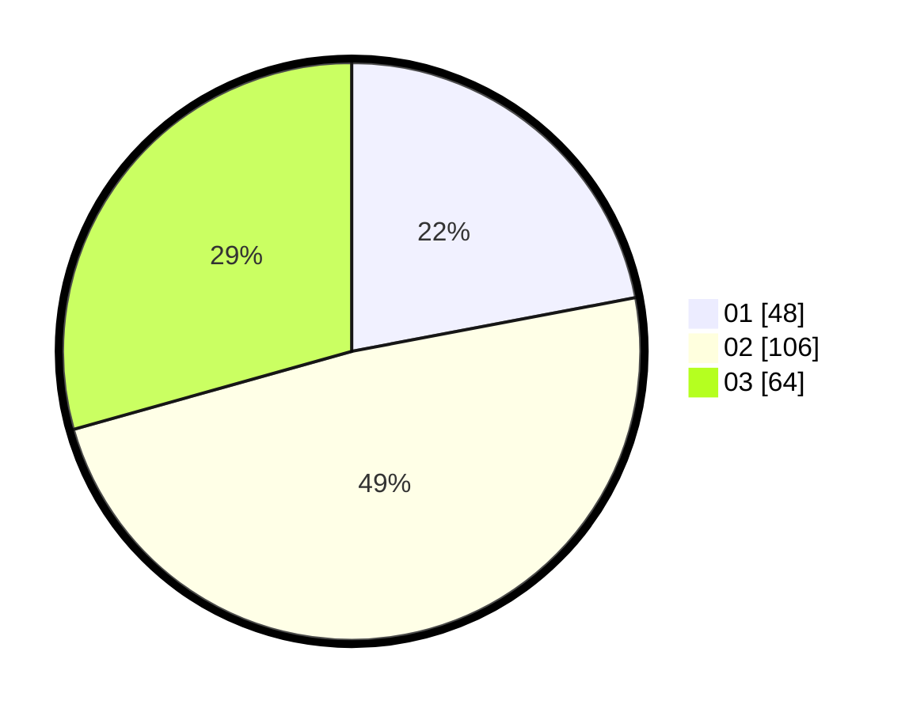

# Hasil

Hasil perolehan suara paslon dapat dilihat pada file paslon-01.txt, paslon-02.txt, dan paslon-03.txt.

Jika tidak ada, artinya data tersebut belum ada pada SIREKAP.

## Perolehan Suara

 * Paslon 01: **48**.
 * Paslon 02: **106**.
 * Paslon 03: **64**.

## Foto C Plano

https://sirekap-obj-formc.kpu.go.id/e5ae/pemilu/ppwp/31/73/01/10/01/3173011001001-20240215-001040--fecac233-4a9e-4e69-b94a-8810ca268d38.jpg

https://sirekap-obj-formc.kpu.go.id/e5ae/pemilu/ppwp/31/73/01/10/01/3173011001001-20240214-184512--7a93927e-59b0-4a3d-a009-96854acdd6c9.jpg

https://sirekap-obj-formc.kpu.go.id/e5ae/pemilu/ppwp/31/73/01/10/01/3173011001001-20240214-160100--b7189aed-ee62-48bc-94ff-147818832ef3.jpg
