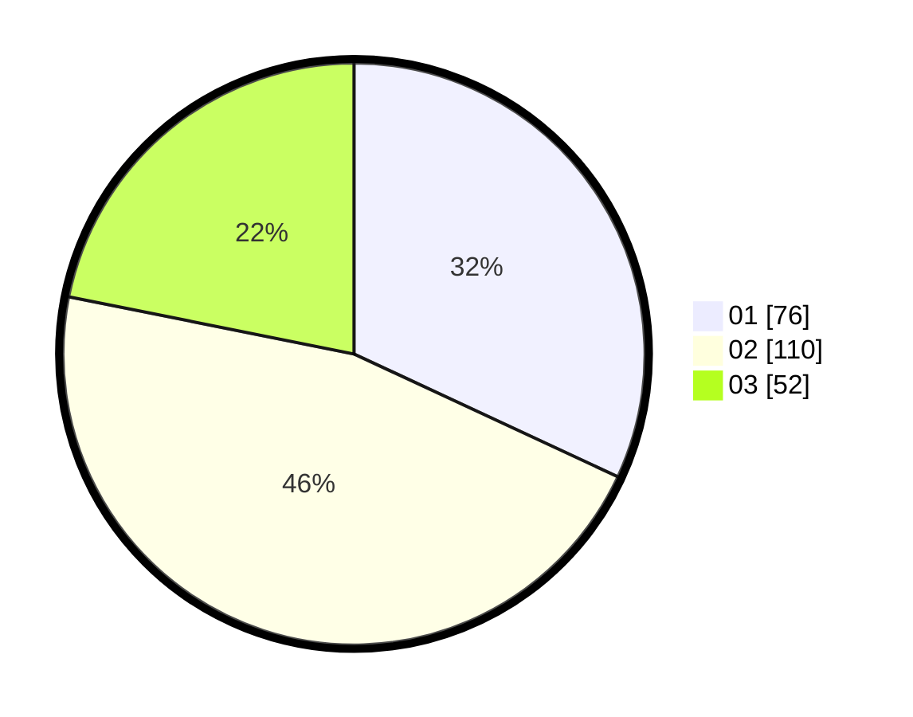

# Hasil

Hasil perolehan suara paslon dapat dilihat pada file paslon-01.txt, paslon-02.txt, dan paslon-03.txt.

Jika tidak ada, artinya data tersebut belum ada pada SIREKAP.

## Perolehan Suara

 * Paslon 01: **76**.
 * Paslon 02: **110**.
 * Paslon 03: **52**.

## Foto C Plano

https://sirekap-obj-formc.kpu.go.id/1763/pemilu/ppwp/31/73/01/10/01/3173011001002-20240215-013227--daa1bfd8-ebb8-41f6-bb59-67dff9335989.jpg

https://sirekap-obj-formc.kpu.go.id/1763/pemilu/ppwp/31/73/01/10/01/3173011001002-20240215-013401--28b4b139-cdae-4bb9-b2bd-d39309ecc0c5.jpg

https://sirekap-obj-formc.kpu.go.id/1763/pemilu/ppwp/31/73/01/10/01/3173011001002-20240215-013441--beb8b23a-a390-47b4-8180-41569db6b422.jpg
