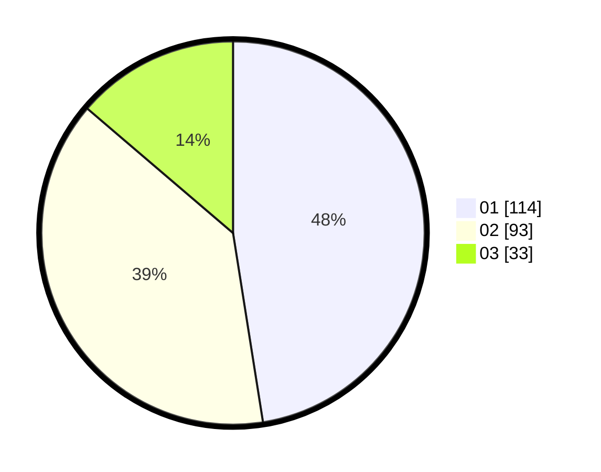

# Hasil

Hasil perolehan suara paslon dapat dilihat pada file paslon-01.txt, paslon-02.txt, dan paslon-03.txt.

Jika tidak ada, artinya data tersebut belum ada pada SIREKAP.

## Perolehan Suara

 * Paslon 01: **114**.
 * Paslon 02: **93**.
 * Paslon 03: **33**.

## Foto C Plano

https://sirekap-obj-formc.kpu.go.id/4971/pemilu/ppwp/31/73/01/10/01/3173011001004-20240215-225048--f348e1f3-9bc0-4335-87a2-f1c6327bcc31.jpg

https://sirekap-obj-formc.kpu.go.id/4971/pemilu/ppwp/31/73/01/10/01/3173011001004-20240215-225050--376e0057-da16-4b25-b2fd-551505cdc668.jpg

https://sirekap-obj-formc.kpu.go.id/4971/pemilu/ppwp/31/73/01/10/01/3173011001004-20240215-225049--c4ccea57-efb6-49b1-bd51-b2364443b90a.jpg

## DATA PEMILIH TETAP

Jumlah pemilih dalam DPT: **280**.
 * L: **127**.
 * P: **153**.

## DATA PENGGUNA HAK PILIH

Jumlah pengguna hak pilih dalam DPT: **227**.
 * L: **98**.
 * P: **129**.

Jumlah pengguna hak pilih dalam DPTb: **16**.
 * L: **5**.
 * P: **11**.

Jumlah pengguna hak pilih dalam DPK: **1**.
 * L: **0**.
 * P: **1**.

Jumlah pengguna hak pilih: **244**.
 * L: **103**.
 * P: **141**.

## JUMLAH SUARA SAH DAN TIDAK SAH

JUMLAH SELURUH SUARA SAH: **240**.

JUMLAH SUARA TIDAK SAH: **4**.

JUMLAH SELURUH SUARA SAH DAN SUARA TIDAK SAH: **244**.
