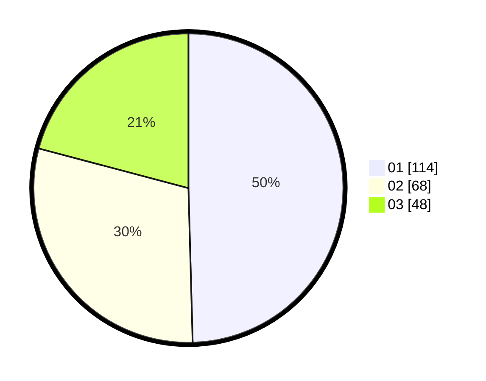

# Hasil

Hasil perolehan suara paslon dapat dilihat pada file paslon-01.txt, paslon-02.txt, dan paslon-03.txt.

Jika tidak ada, artinya data tersebut belum ada pada SIREKAP.

## Perolehan Suara

 * Paslon 01: **114**.
 * Paslon 02: **68**.
 * Paslon 03: **48**.

## Foto C Plano

https://sirekap-obj-formc.kpu.go.id/bddd/pemilu/ppwp/31/73/01/10/01/3173011001005-20240215-043828--11bac26c-9753-471d-8f05-5bb69ecc3afb.jpg

https://sirekap-obj-formc.kpu.go.id/bddd/pemilu/ppwp/31/73/01/10/01/3173011001005-20240215-043936--c26e38c8-bbbf-47db-9f15-38a9ae41c502.jpg

https://sirekap-obj-formc.kpu.go.id/bddd/pemilu/ppwp/31/73/01/10/01/3173011001005-20240214-211612--675021e3-21a1-40b4-9b02-a11fb2674e13.jpg
