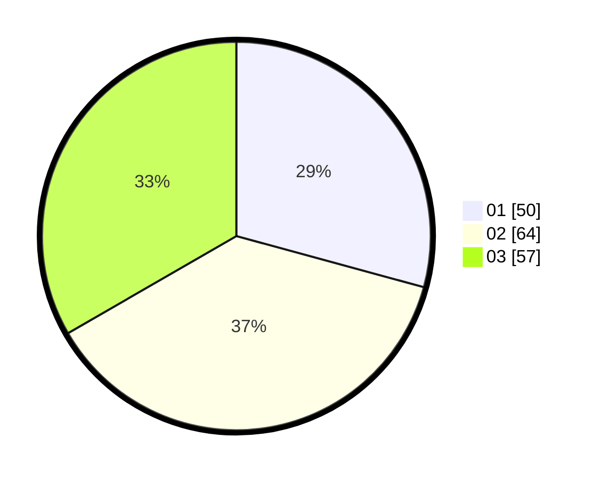

# Hasil

Hasil perolehan suara paslon dapat dilihat pada file paslon-01.txt, paslon-02.txt, dan paslon-03.txt.

Jika tidak ada, artinya data tersebut belum ada pada SIREKAP.

## Perolehan Suara

 * Paslon 01: **50**.
 * Paslon 02: **64**.
 * Paslon 03: **57**.

## Foto C Plano

https://sirekap-obj-formc.kpu.go.id/a684/pemilu/ppwp/31/73/01/10/01/3173011001009-20240214-193520--6d9bcbce-d5f0-4961-86b9-9078b7178de6.jpg

https://sirekap-obj-formc.kpu.go.id/a684/pemilu/ppwp/31/73/01/10/01/3173011001009-20240214-193622--8e881c1a-e959-4987-880d-6f0e73ba055e.jpg

https://sirekap-obj-formc.kpu.go.id/a684/pemilu/ppwp/31/73/01/10/01/3173011001009-20240214-233509--4da40307-292f-4cbc-b6d7-980472a7d17c.jpg
