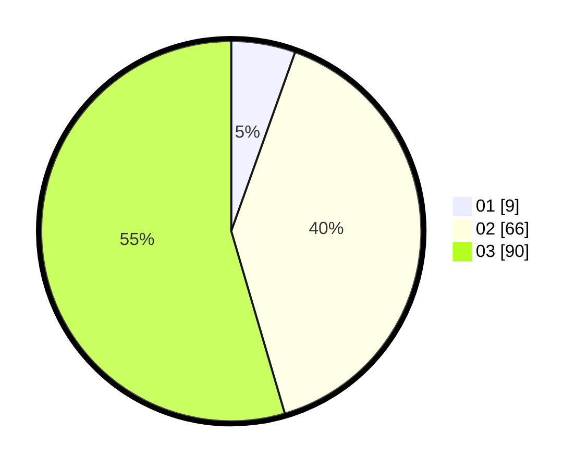

# Hasil

Hasil perolehan suara paslon dapat dilihat pada file paslon-01.txt, paslon-02.txt, dan paslon-03.txt.

Jika tidak ada, artinya data tersebut belum ada pada SIREKAP.

## Perolehan Suara

 * Paslon 01: **9**.
 * Paslon 02: **66**.
 * Paslon 03: **90**.

## Foto C Plano

https://sirekap-obj-formc.kpu.go.id/1df4/pemilu/ppwp/31/73/01/10/01/3173011001013-20240214-201426--54608786-c0b2-44ee-bc49-9e35e3c3ec9d.jpg

https://sirekap-obj-formc.kpu.go.id/1df4/pemilu/ppwp/31/73/01/10/01/3173011001013-20240214-201432--ee7210c9-42d1-4f28-b7f4-a6f82c5dfbd6.jpg

https://sirekap-obj-formc.kpu.go.id/1df4/pemilu/ppwp/31/73/01/10/01/3173011001013-20240214-201439--2369bac5-0da9-4c86-a13e-965641b280af.jpg

## DATA PEMILIH TETAP

Jumlah pemilih dalam DPT: **200**.
 * L: **95**.
 * P: **105**.

## DATA PENGGUNA HAK PILIH

Jumlah pengguna hak pilih dalam DPT: **157**.
 * L: **83**.
 * P: **74**.

Jumlah pengguna hak pilih dalam DPTb: **4**.
 * L: **2**.
 * P: **2**.

Jumlah pengguna hak pilih dalam DPK: **5**.
 * L: **3**.
 * P: **2**.

Jumlah pengguna hak pilih: **166**.
 * L: **88**.
 * P: **78**.

## JUMLAH SUARA SAH DAN TIDAK SAH

JUMLAH SELURUH SUARA SAH: **165**.

JUMLAH SUARA TIDAK SAH: **1**.

JUMLAH SELURUH SUARA SAH DAN SUARA TIDAK SAH: **166**.
