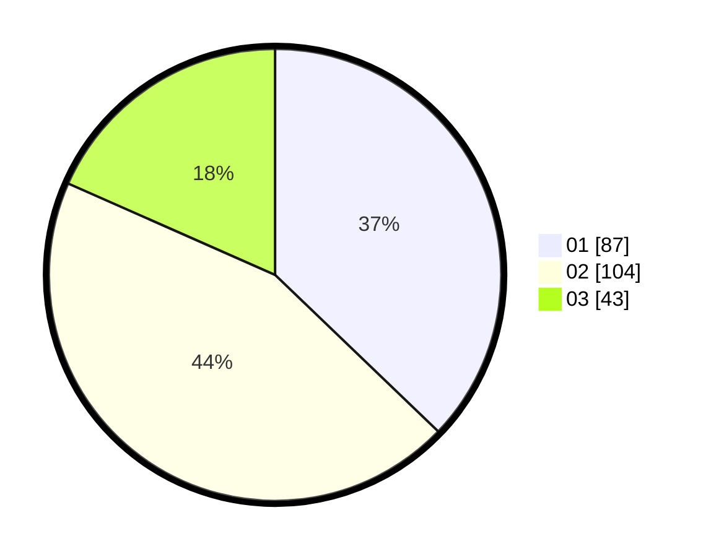

# Hasil

Hasil perolehan suara paslon dapat dilihat pada file paslon-01.txt, paslon-02.txt, dan paslon-03.txt.

Jika tidak ada, artinya data tersebut belum ada pada SIREKAP.

## Perolehan Suara

 * Paslon 01: **87**.
 * Paslon 02: **104**.
 * Paslon 03: **43**.

## Foto C Plano

https://sirekap-obj-formc.kpu.go.id/5ba3/pemilu/ppwp/31/73/01/10/01/3173011001019-20240214-191045--93afe509-570f-4f36-a499-04f94f93a805.jpg

https://sirekap-obj-formc.kpu.go.id/5ba3/pemilu/ppwp/31/73/01/10/01/3173011001019-20240214-191211--4945faee-b41e-4818-8f80-8c0c280d0653.jpg

https://sirekap-obj-formc.kpu.go.id/5ba3/pemilu/ppwp/31/73/01/10/01/3173011001019-20240214-191512--b79ee987-c446-4ee4-a7a2-dd3aa1e123db.jpg

## DATA PEMILIH TETAP

Jumlah pemilih dalam DPT: **228**.
 * L: **103**.
 * P: **125**.

## DATA PENGGUNA HAK PILIH

Jumlah pengguna hak pilih dalam DPT: **228**.
 * L: **103**.
 * P: **125**.

Jumlah pengguna hak pilih dalam DPTb: **5**.
 * L: **2**.
 * P: **3**.

Jumlah pengguna hak pilih dalam DPK: **4**.
 * L: **2**.
 * P: **2**.

Jumlah pengguna hak pilih: **237**.
 * L: **107**.
 * P: **130**.

## JUMLAH SUARA SAH DAN TIDAK SAH

JUMLAH SELURUH SUARA SAH: **234**.

JUMLAH SUARA TIDAK SAH: **3**.

JUMLAH SELURUH SUARA SAH DAN SUARA TIDAK SAH: **237**.
