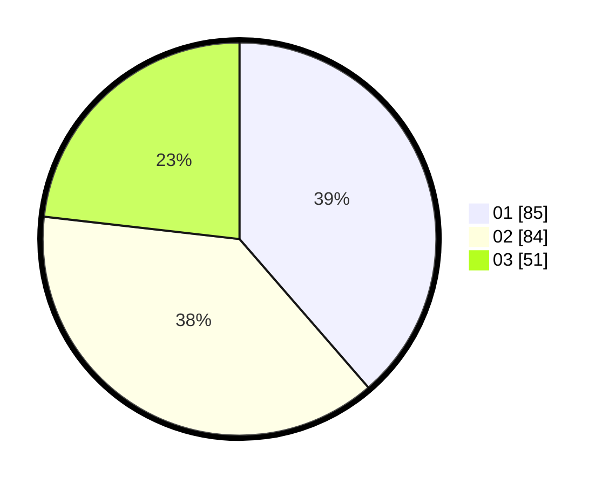

# Hasil

Hasil perolehan suara paslon dapat dilihat pada file paslon-01.txt, paslon-02.txt, dan paslon-03.txt.

Jika tidak ada, artinya data tersebut belum ada pada SIREKAP.

## Perolehan Suara

 * Paslon 01: **85**.
 * Paslon 02: **84**.
 * Paslon 03: **51**.

## Foto C Plano

https://sirekap-obj-formc.kpu.go.id/d956/pemilu/ppwp/31/73/01/10/01/3173011001020-20240215-020212--fe6f7eab-c149-4cfe-8132-a89b0d417b8f.jpg

https://sirekap-obj-formc.kpu.go.id/d956/pemilu/ppwp/31/73/01/10/01/3173011001020-20240215-020316--8a2a45dc-8f9d-4b59-9ccf-225342eff5e1.jpg

https://sirekap-obj-formc.kpu.go.id/d956/pemilu/ppwp/31/73/01/10/01/3173011001020-20240215-020409--24c1d838-7523-456b-bac7-3ceebeae0e77.jpg

## DATA PEMILIH TETAP

Jumlah pemilih dalam DPT: **278**.
 * L: **136**.
 * P: **142**.

## DATA PENGGUNA HAK PILIH

Jumlah pengguna hak pilih dalam DPT: **214**.
 * L: **100**.
 * P: **114**.

Jumlah pengguna hak pilih dalam DPTb: **4**.
 * L: **1**.
 * P: **3**.

Jumlah pengguna hak pilih dalam DPK: **4**.
 * L: **1**.
 * P: **3**.

Jumlah pengguna hak pilih: **222**.
 * L: **102**.
 * P: **120**.

## JUMLAH SUARA SAH DAN TIDAK SAH

JUMLAH SELURUH SUARA SAH: **220**.

JUMLAH SUARA TIDAK SAH: **2**.

JUMLAH SELURUH SUARA SAH DAN SUARA TIDAK SAH: **222**.
