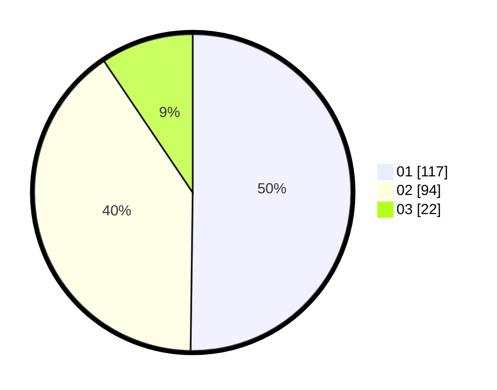

# Hasil

Hasil perolehan suara paslon dapat dilihat pada file paslon-01.txt, paslon-02.txt, dan paslon-03.txt.

Jika tidak ada, artinya data tersebut belum ada pada SIREKAP.

## Perolehan Suara

 * Paslon 01: **117**.
 * Paslon 02: **94**.
 * Paslon 03: **22**.

## Foto C Plano

https://sirekap-obj-formc.kpu.go.id/924d/pemilu/ppwp/31/73/01/10/01/3173011001021-20240214-210435--282a37a4-298a-465d-b830-fb2ddd65b08a.jpg

https://sirekap-obj-formc.kpu.go.id/924d/pemilu/ppwp/31/73/01/10/01/3173011001021-20240214-215206--fa1c3a6d-3035-4030-aed7-b75550247431.jpg

https://sirekap-obj-formc.kpu.go.id/924d/pemilu/ppwp/31/73/01/10/01/3173011001021-20240214-221235--21a4b83e-f04c-4cba-b635-5f55552c4c3d.jpg
