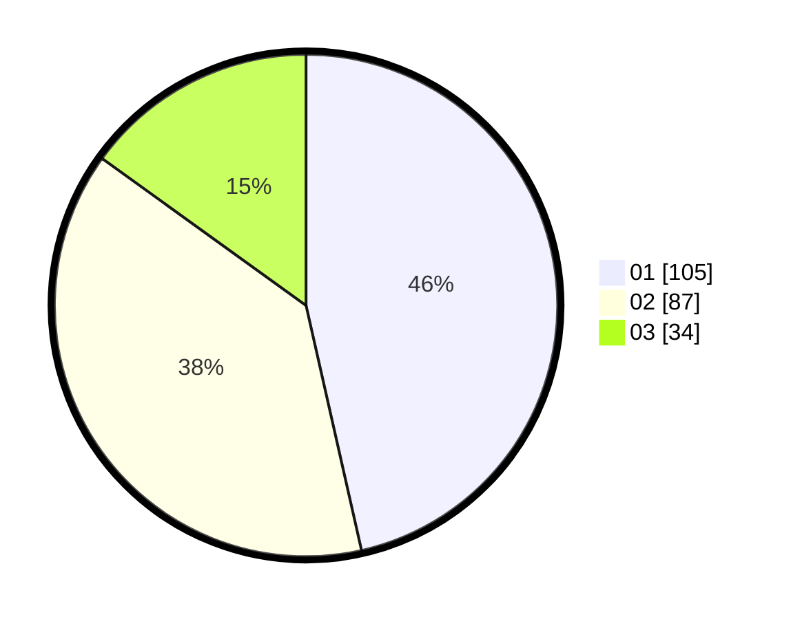

# Hasil

Hasil perolehan suara paslon dapat dilihat pada file paslon-01.txt, paslon-02.txt, dan paslon-03.txt.

Jika tidak ada, artinya data tersebut belum ada pada SIREKAP.

## Perolehan Suara

 * Paslon 01: **105**.
 * Paslon 02: **87**.
 * Paslon 03: **34**.

## Foto C Plano

https://sirekap-obj-formc.kpu.go.id/d12a/pemilu/ppwp/31/73/01/10/01/3173011001024-20240215-001224--acb8c66a-62c3-4442-93ac-c26732b183bf.jpg

https://sirekap-obj-formc.kpu.go.id/d12a/pemilu/ppwp/31/73/01/10/01/3173011001024-20240215-001340--b5633ea4-ac5b-4a56-b376-0925cbeaf139.jpg

https://sirekap-obj-formc.kpu.go.id/d12a/pemilu/ppwp/31/73/01/10/01/3173011001024-20240215-001419--5a07339d-1741-44af-acaa-40c68cba1508.jpg
