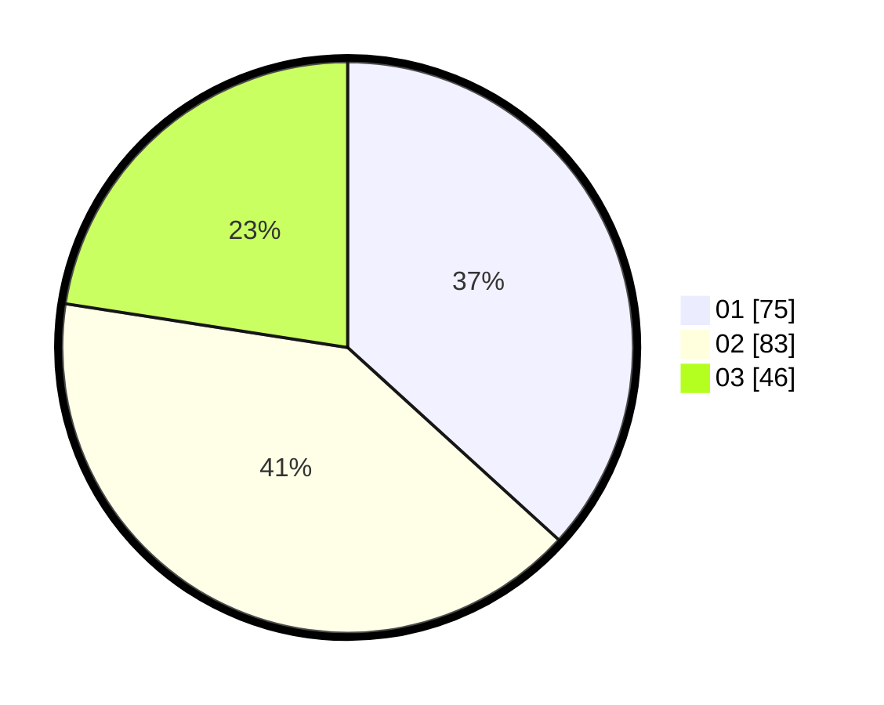

# Hasil

Hasil perolehan suara paslon dapat dilihat pada file paslon-01.txt, paslon-02.txt, dan paslon-03.txt.

Jika tidak ada, artinya data tersebut belum ada pada SIREKAP.

## Perolehan Suara

 * Paslon 01: **75**.
 * Paslon 02: **83**.
 * Paslon 03: **46**.

## Foto C Plano

https://sirekap-obj-formc.kpu.go.id/fab3/pemilu/ppwp/31/73/01/10/01/3173011001025-20240215-004250--344ad36f-67fc-41d9-ad8e-72c5468e303e.jpg

https://sirekap-obj-formc.kpu.go.id/fab3/pemilu/ppwp/31/73/01/10/01/3173011001025-20240215-025404--82eb1054-071b-4f55-bc33-f6e8aacb2d2b.jpg

https://sirekap-obj-formc.kpu.go.id/fab3/pemilu/ppwp/31/73/01/10/01/3173011001025-20240215-004119--1839de27-6e90-4ae6-9572-da761172ec92.jpg
