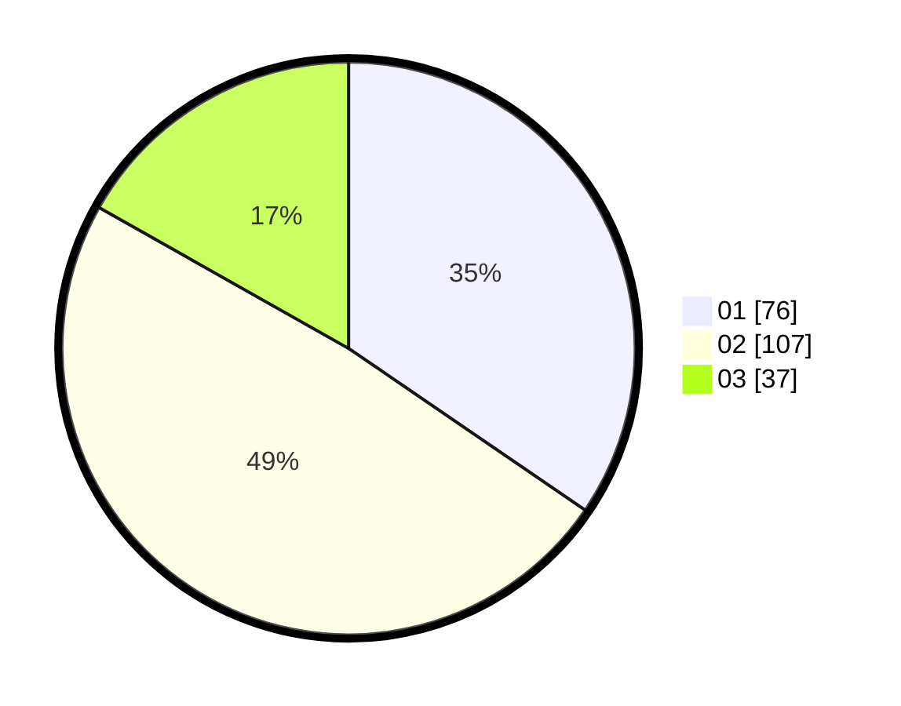

# Hasil

Hasil perolehan suara paslon dapat dilihat pada file paslon-01.txt, paslon-02.txt, dan paslon-03.txt.

Jika tidak ada, artinya data tersebut belum ada pada SIREKAP.

## Perolehan Suara

 * Paslon 01: **76**.
 * Paslon 02: **107**.
 * Paslon 03: **37**.

## Foto C Plano

https://sirekap-obj-formc.kpu.go.id/3148/pemilu/ppwp/31/73/01/10/01/3173011001026-20240215-002739--da869712-10ff-464f-878a-413b9726b850.jpg

https://sirekap-obj-formc.kpu.go.id/3148/pemilu/ppwp/31/73/01/10/01/3173011001026-20240215-002803--c1fb2218-9831-4465-ade3-e1395e0b7a01.jpg

https://sirekap-obj-formc.kpu.go.id/3148/pemilu/ppwp/31/73/01/10/01/3173011001026-20240215-002902--b5c075a2-6c79-4527-a7cd-969e14b2a1f7.jpg
