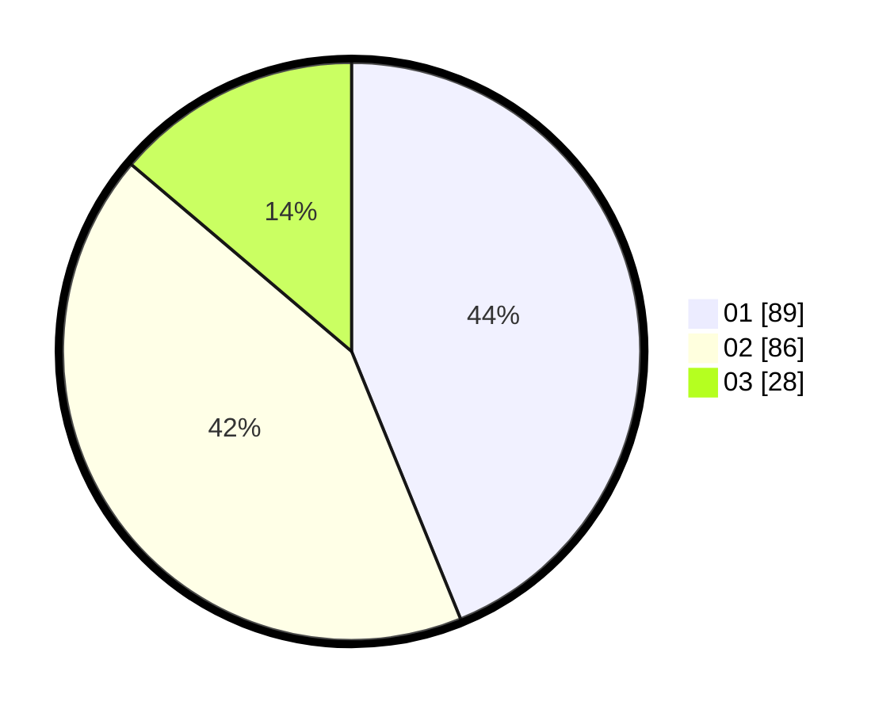

# Hasil

Hasil perolehan suara paslon dapat dilihat pada file paslon-01.txt, paslon-02.txt, dan paslon-03.txt.

Jika tidak ada, artinya data tersebut belum ada pada SIREKAP.

## Perolehan Suara

 * Paslon 01: **89**.
 * Paslon 02: **86**.
 * Paslon 03: **28**.

## Foto C Plano

https://sirekap-obj-formc.kpu.go.id/43d9/pemilu/ppwp/31/73/01/10/01/3173011001031-20240215-034820--071ddcfc-938c-4ef7-b110-d43f0c4b9d50.jpg

https://sirekap-obj-formc.kpu.go.id/43d9/pemilu/ppwp/31/73/01/10/01/3173011001031-20240215-034913--96487570-a85d-4b22-84c2-95041143b6f2.jpg

https://sirekap-obj-formc.kpu.go.id/43d9/pemilu/ppwp/31/73/01/10/01/3173011001031-20240215-035029--fd39b97f-e85d-42c9-8264-ae3435020420.jpg

## DATA PEMILIH TETAP

Jumlah pemilih dalam DPT: **275**.
 * L: **125**.
 * P: **150**.

## DATA PENGGUNA HAK PILIH

Jumlah pengguna hak pilih dalam DPT: **203**.
 * L: **87**.
 * P: **116**.

Jumlah pengguna hak pilih dalam DPTb: **6**.
 * L: **1**.
 * P: **5**.

Jumlah pengguna hak pilih dalam DPK: **2**.
 * L: **0**.
 * P: **2**.

Jumlah pengguna hak pilih: **211**.
 * L: **88**.
 * P: **123**.

## JUMLAH SUARA SAH DAN TIDAK SAH

JUMLAH SELURUH SUARA SAH: **203**.

JUMLAH SUARA TIDAK SAH: **8**.

JUMLAH SELURUH SUARA SAH DAN SUARA TIDAK SAH: **211**.
