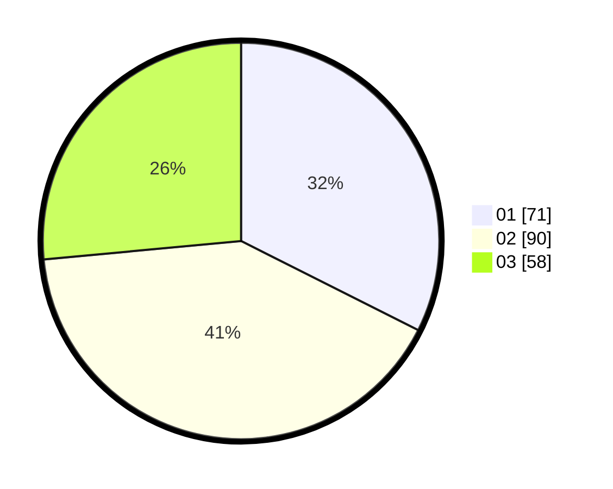

# Hasil

Hasil perolehan suara paslon dapat dilihat pada file paslon-01.txt, paslon-02.txt, dan paslon-03.txt.

Jika tidak ada, artinya data tersebut belum ada pada SIREKAP.

## Perolehan Suara

 * Paslon 01: **71**.
 * Paslon 02: **90**.
 * Paslon 03: **58**.

## Foto C Plano

https://sirekap-obj-formc.kpu.go.id/ef87/pemilu/ppwp/31/73/01/10/01/3173011001033-20240214-222026--ca03926f-6a08-42b8-88be-8f8d936b8e27.jpg

https://sirekap-obj-formc.kpu.go.id/ef87/pemilu/ppwp/31/73/01/10/01/3173011001033-20240214-222200--6e39064c-1625-4b2b-a48e-8731f992a92e.jpg

https://sirekap-obj-formc.kpu.go.id/ef87/pemilu/ppwp/31/73/01/10/01/3173011001033-20240214-222335--e4d29707-ed2f-4376-ab3f-05d628860be2.jpg
