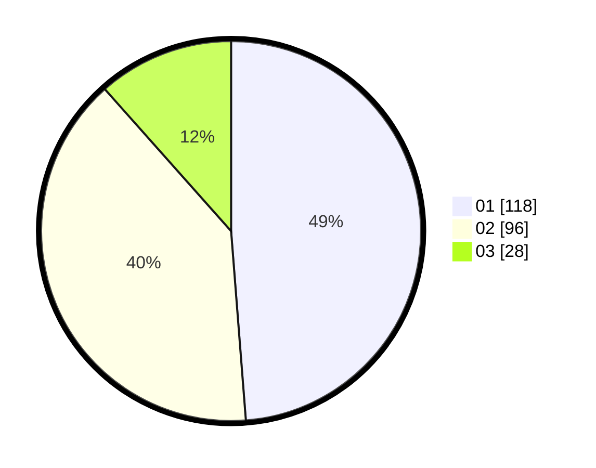

# Hasil

Hasil perolehan suara paslon dapat dilihat pada file paslon-01.txt, paslon-02.txt, dan paslon-03.txt.

Jika tidak ada, artinya data tersebut belum ada pada SIREKAP.

## Perolehan Suara

 * Paslon 01: **118**.
 * Paslon 02: **96**.
 * Paslon 03: **28**.

## Foto C Plano

https://sirekap-obj-formc.kpu.go.id/0e6f/pemilu/ppwp/31/73/01/10/01/3173011001037-20240215-022904--033fc55f-1e54-4dfc-b374-3c47a96d0566.jpg

https://sirekap-obj-formc.kpu.go.id/0e6f/pemilu/ppwp/31/73/01/10/01/3173011001037-20240215-012405--93cca201-1161-4d93-9949-ffdc43319c1e.jpg

https://sirekap-obj-formc.kpu.go.id/0e6f/pemilu/ppwp/31/73/01/10/01/3173011001037-20240215-022609--b1cc5749-1e90-49b8-8916-9f5bc630e216.jpg
