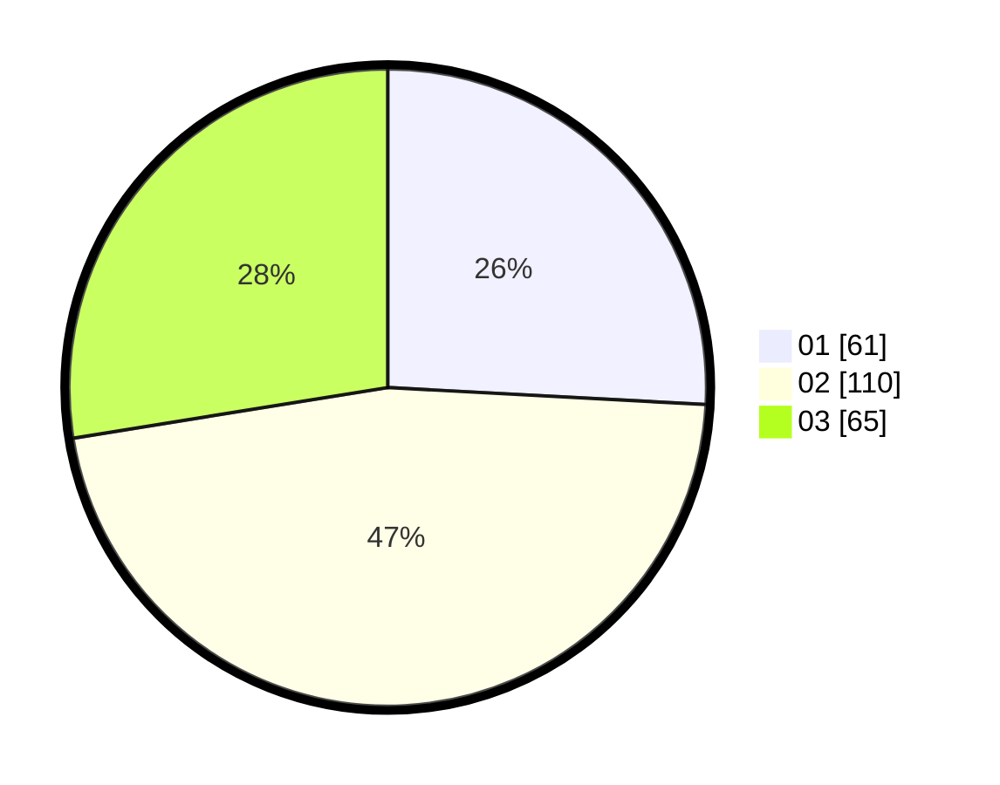

# Hasil

Hasil perolehan suara paslon dapat dilihat pada file paslon-01.txt, paslon-02.txt, dan paslon-03.txt.

Jika tidak ada, artinya data tersebut belum ada pada SIREKAP.

## Perolehan Suara

 * Paslon 01: **61**.
 * Paslon 02: **110**.
 * Paslon 03: **65**.

## Foto C Plano

https://sirekap-obj-formc.kpu.go.id/64fe/pemilu/ppwp/31/73/01/10/01/3173011001040-20240214-232101--4e5df58d-9558-414c-b99e-690430cf9265.jpg

https://sirekap-obj-formc.kpu.go.id/64fe/pemilu/ppwp/31/73/01/10/01/3173011001040-20240214-232215--378c226c-cc18-4144-82ca-6112496f3947.jpg

https://sirekap-obj-formc.kpu.go.id/64fe/pemilu/ppwp/31/73/01/10/01/3173011001040-20240214-232259--2e8f1621-840c-41a1-9e9a-488009ddde0c.jpg
