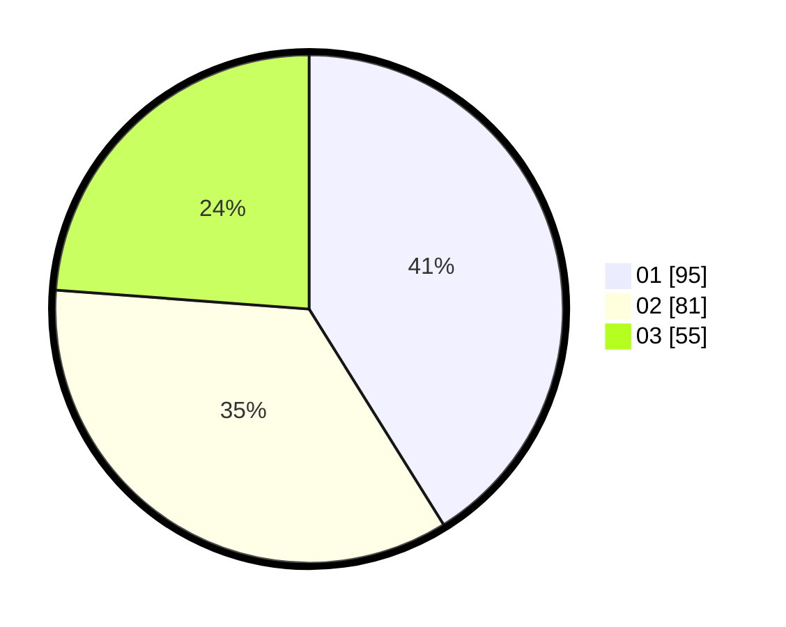

# Hasil

Hasil perolehan suara paslon dapat dilihat pada file paslon-01.txt, paslon-02.txt, dan paslon-03.txt.

Jika tidak ada, artinya data tersebut belum ada pada SIREKAP.

## Perolehan Suara

 * Paslon 01: **95**.
 * Paslon 02: **81**.
 * Paslon 03: **55**.

## Foto C Plano

https://sirekap-obj-formc.kpu.go.id/f1f0/pemilu/ppwp/31/73/01/10/01/3173011001041-20240214-155315--6856f1a8-9742-43ee-8319-71af382959cb.jpg

https://sirekap-obj-formc.kpu.go.id/f1f0/pemilu/ppwp/31/73/01/10/01/3173011001041-20240214-160056--3b6d963f-c5af-4541-a3bf-49e5157671d0.jpg

https://sirekap-obj-formc.kpu.go.id/f1f0/pemilu/ppwp/31/73/01/10/01/3173011001041-20240214-155218--d3b103a3-89dc-4441-909b-25100bb0ed64.jpg
