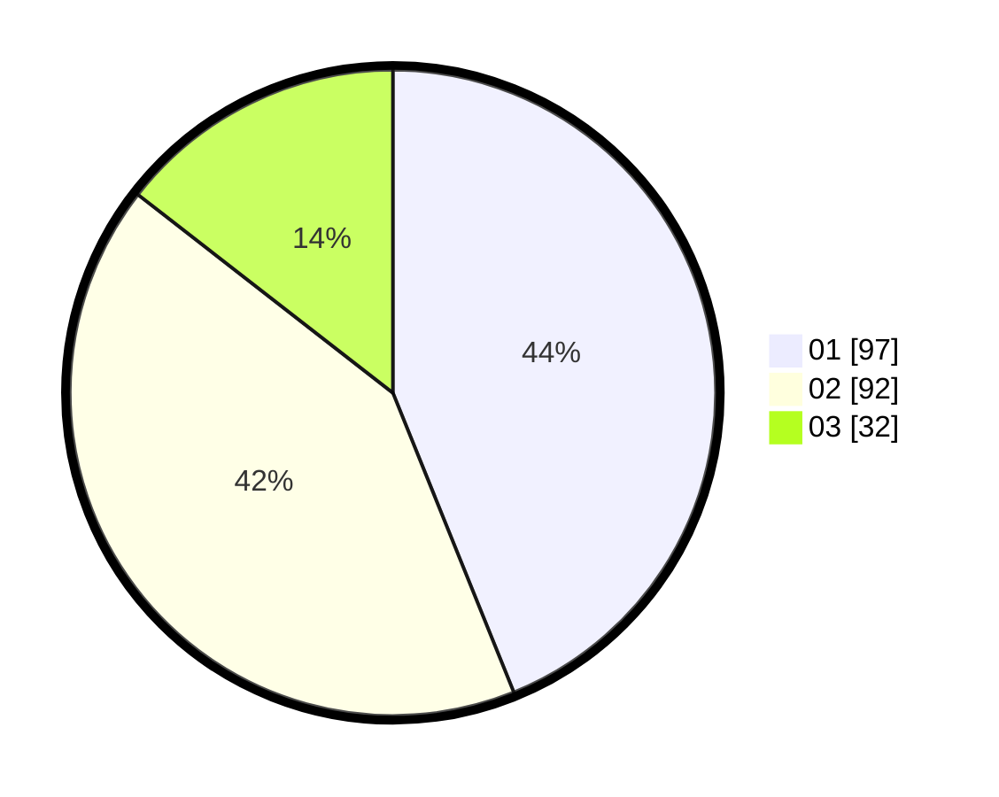

# Hasil

Hasil perolehan suara paslon dapat dilihat pada file paslon-01.txt, paslon-02.txt, dan paslon-03.txt.

Jika tidak ada, artinya data tersebut belum ada pada SIREKAP.

## Perolehan Suara

 * Paslon 01: **97**.
 * Paslon 02: **92**.
 * Paslon 03: **32**.

## Foto C Plano

https://sirekap-obj-formc.kpu.go.id/be4a/pemilu/ppwp/31/73/01/10/01/3173011001042-20240214-195405--d44d7b4e-d781-4173-a2bb-f041ee99d797.jpg

https://sirekap-obj-formc.kpu.go.id/be4a/pemilu/ppwp/31/73/01/10/01/3173011001042-20240214-205933--09022246-6902-429f-bdca-e021dd01b032.jpg

https://sirekap-obj-formc.kpu.go.id/be4a/pemilu/ppwp/31/73/01/10/01/3173011001042-20240214-194252--5b50d665-891e-41b8-8685-4b7973fd6957.jpg
