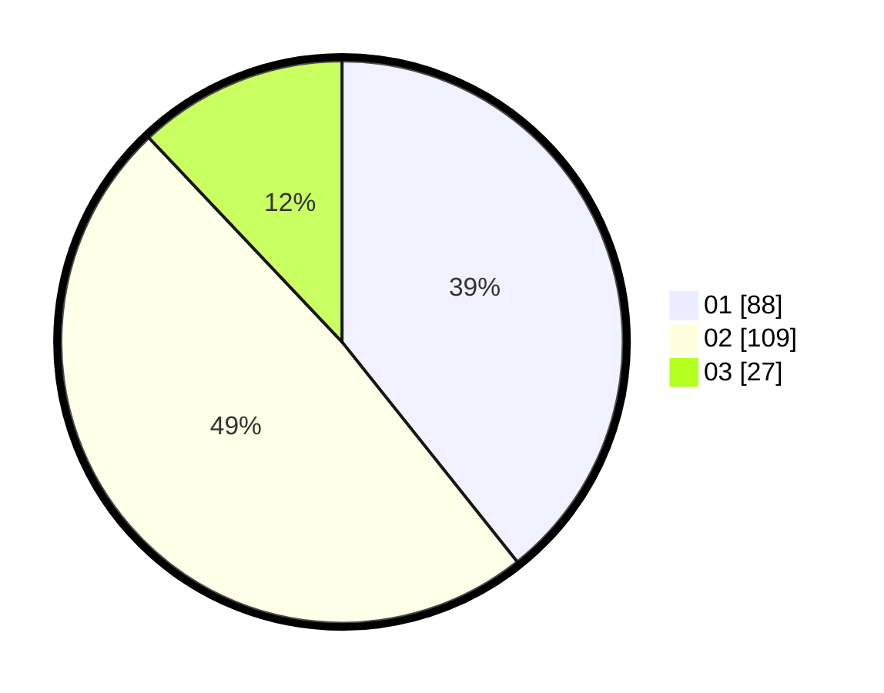

# Hasil

Hasil perolehan suara paslon dapat dilihat pada file paslon-01.txt, paslon-02.txt, dan paslon-03.txt.

Jika tidak ada, artinya data tersebut belum ada pada SIREKAP.

## Perolehan Suara

 * Paslon 01: **88**.
 * Paslon 02: **109**.
 * Paslon 03: **27**.

## Foto C Plano

https://sirekap-obj-formc.kpu.go.id/c645/pemilu/ppwp/31/73/01/10/01/3173011001043-20240216-125219--4affaede-811c-40a2-9c4d-4cdfbfd48c4f.jpg

https://sirekap-obj-formc.kpu.go.id/c645/pemilu/ppwp/31/73/01/10/01/3173011001043-20240216-125224--3d971cfb-d161-4a9f-b4e0-15ef7ddd162b.jpg

https://sirekap-obj-formc.kpu.go.id/c645/pemilu/ppwp/31/73/01/10/01/3173011001043-20240216-125223--81cc6ae3-135b-4470-9460-563be0134354.jpg

## DATA PEMILIH TETAP

Jumlah pemilih dalam DPT: **281**.
 * L: **132**.
 * P: **149**.

## DATA PENGGUNA HAK PILIH

Jumlah pengguna hak pilih dalam DPT: **222**.
 * L: **107**.
 * P: **115**.

Jumlah pengguna hak pilih dalam DPTb: **4**.
 * L: **1**.
 * P: **3**.

Jumlah pengguna hak pilih dalam DPK: **1**.
 * L: **0**.
 * P: **1**.

Jumlah pengguna hak pilih: **227**.
 * L: **108**.
 * P: **119**.

## JUMLAH SUARA SAH DAN TIDAK SAH

JUMLAH SELURUH SUARA SAH: **224**.

JUMLAH SUARA TIDAK SAH: **3**.

JUMLAH SELURUH SUARA SAH DAN SUARA TIDAK SAH: **227**.
