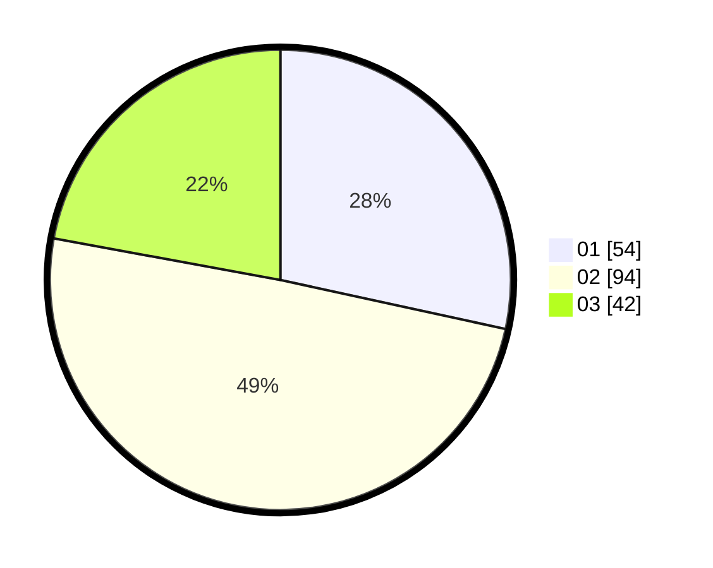

# Hasil

Hasil perolehan suara paslon dapat dilihat pada file paslon-01.txt, paslon-02.txt, dan paslon-03.txt.

Jika tidak ada, artinya data tersebut belum ada pada SIREKAP.

## Perolehan Suara

 * Paslon 01: **54**.
 * Paslon 02: **94**.
 * Paslon 03: **42**.

## Foto C Plano

https://sirekap-obj-formc.kpu.go.id/5478/pemilu/ppwp/31/73/01/10/01/3173011001046-20240215-003734--a76a3891-8dbf-4ce3-90a0-470bee66dc7a.jpg

https://sirekap-obj-formc.kpu.go.id/5478/pemilu/ppwp/31/73/01/10/01/3173011001046-20240215-004034--d82be324-5260-42ac-8bfb-7d52a11aee10.jpg

https://sirekap-obj-formc.kpu.go.id/5478/pemilu/ppwp/31/73/01/10/01/3173011001046-20240215-004248--edb56b01-2579-402d-92a7-2cd82a6e6c9a.jpg
