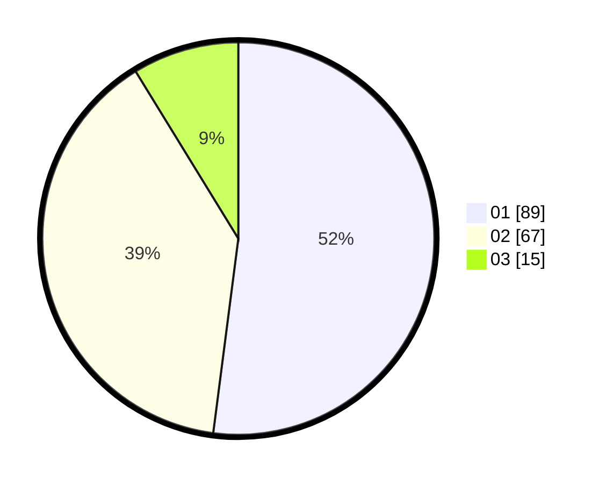

# Hasil

Hasil perolehan suara paslon dapat dilihat pada file paslon-01.txt, paslon-02.txt, dan paslon-03.txt.

Jika tidak ada, artinya data tersebut belum ada pada SIREKAP.

## Perolehan Suara

 * Paslon 01: **89**.
 * Paslon 02: **67**.
 * Paslon 03: **15**.

## Foto C Plano

https://sirekap-obj-formc.kpu.go.id/6f76/pemilu/ppwp/31/73/01/10/01/3173011001049-20240216-142537--0c60c237-c693-4e6c-a864-e7b7e14790bb.jpg

https://sirekap-obj-formc.kpu.go.id/6f76/pemilu/ppwp/31/73/01/10/01/3173011001049-20240216-142538--09a16665-5ddc-4b3c-b456-7a6ec4e0cbc7.jpg

https://sirekap-obj-formc.kpu.go.id/6f76/pemilu/ppwp/31/73/01/10/01/3173011001049-20240216-142537--1952df89-4429-4008-a658-dacb3f38e192.jpg

## DATA PEMILIH TETAP

Jumlah pemilih dalam DPT: **171**.
 * L: **83**.
 * P: **88**.

## DATA PENGGUNA HAK PILIH

Jumlah pengguna hak pilih dalam DPT: **171**.
 * L: **83**.
 * P: **88**.

Jumlah pengguna hak pilih dalam DPTb: **0**.
 * L: **0**.
 * P: **0**.

Jumlah pengguna hak pilih dalam DPK: **2**.
 * L: **2**.
 * P: **0**.

Jumlah pengguna hak pilih: **173**.
 * L: **85**.
 * P: **88**.

## JUMLAH SUARA SAH DAN TIDAK SAH

JUMLAH SELURUH SUARA SAH: **171**.

JUMLAH SUARA TIDAK SAH: **2**.

JUMLAH SELURUH SUARA SAH DAN SUARA TIDAK SAH: **173**.
