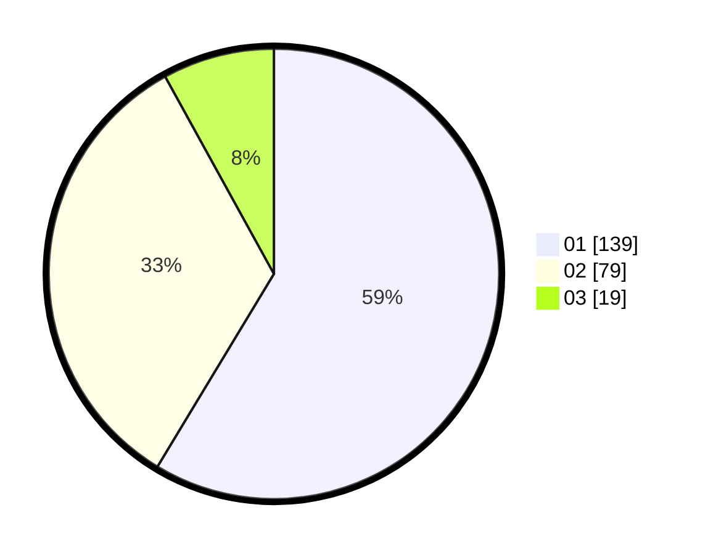

# Hasil

Hasil perolehan suara paslon dapat dilihat pada file paslon-01.txt, paslon-02.txt, dan paslon-03.txt.

Jika tidak ada, artinya data tersebut belum ada pada SIREKAP.

## Perolehan Suara

 * Paslon 01: **139**.
 * Paslon 02: **79**.
 * Paslon 03: **19**.

## Foto C Plano

https://sirekap-obj-formc.kpu.go.id/8885/pemilu/ppwp/31/73/01/10/01/3173011001051-20240215-021622--fe4be9e0-8b8b-4039-8848-31ddfe77b414.jpg

https://sirekap-obj-formc.kpu.go.id/8885/pemilu/ppwp/31/73/01/10/01/3173011001051-20240215-021708--07375d10-f18e-4c16-a51c-a8ad7db8935a.jpg

https://sirekap-obj-formc.kpu.go.id/8885/pemilu/ppwp/31/73/01/10/01/3173011001051-20240214-190050--b754ab6b-5c10-41e4-8215-5dfe18d18fa6.jpg
