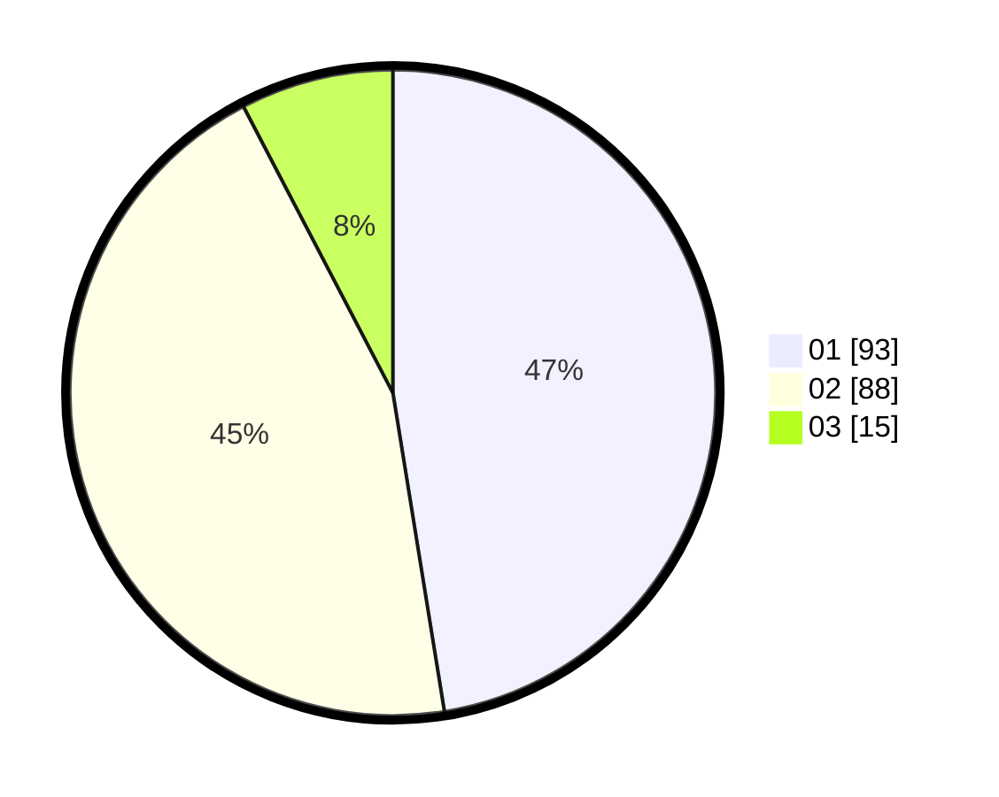

# Hasil

Hasil perolehan suara paslon dapat dilihat pada file paslon-01.txt, paslon-02.txt, dan paslon-03.txt.

Jika tidak ada, artinya data tersebut belum ada pada SIREKAP.

## Perolehan Suara

 * Paslon 01: **93**.
 * Paslon 02: **88**.
 * Paslon 03: **15**.

## Foto C Plano

https://sirekap-obj-formc.kpu.go.id/9a5a/pemilu/ppwp/31/73/01/10/01/3173011001054-20240214-213355--42a6d275-e881-4ac8-8861-05409c6337c1.jpg

https://sirekap-obj-formc.kpu.go.id/9a5a/pemilu/ppwp/31/73/01/10/01/3173011001054-20240214-235948--37ae7d20-35ef-454a-977b-1fa394b7909f.jpg

https://sirekap-obj-formc.kpu.go.id/9a5a/pemilu/ppwp/31/73/01/10/01/3173011001054-20240215-012922--adbfad39-d64f-4dc4-92f5-92ded3f5664b.jpg
