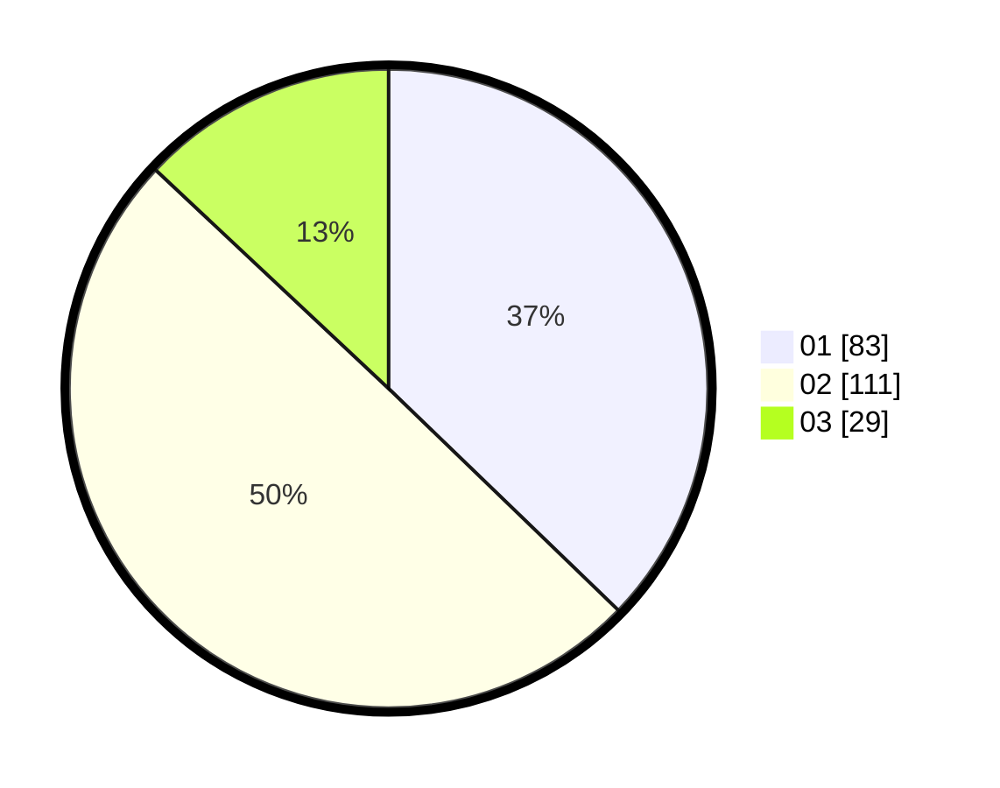

# Hasil

Hasil perolehan suara paslon dapat dilihat pada file paslon-01.txt, paslon-02.txt, dan paslon-03.txt.

Jika tidak ada, artinya data tersebut belum ada pada SIREKAP.

## Perolehan Suara

 * Paslon 01: **83**.
 * Paslon 02: **111**.
 * Paslon 03: **29**.

## Foto C Plano

https://sirekap-obj-formc.kpu.go.id/90d6/pemilu/ppwp/31/73/01/10/01/3173011001059-20240215-013550--c4b3eca1-5546-4ef3-a8ec-f6456b3eca3a.jpg

https://sirekap-obj-formc.kpu.go.id/90d6/pemilu/ppwp/31/73/01/10/01/3173011001059-20240214-225316--abfe5602-ac0d-49c3-a17c-e1f76e4bdabf.jpg

https://sirekap-obj-formc.kpu.go.id/90d6/pemilu/ppwp/31/73/01/10/01/3173011001059-20240214-225420--75dec6d3-6991-4c75-94e2-2aeef723b46b.jpg
