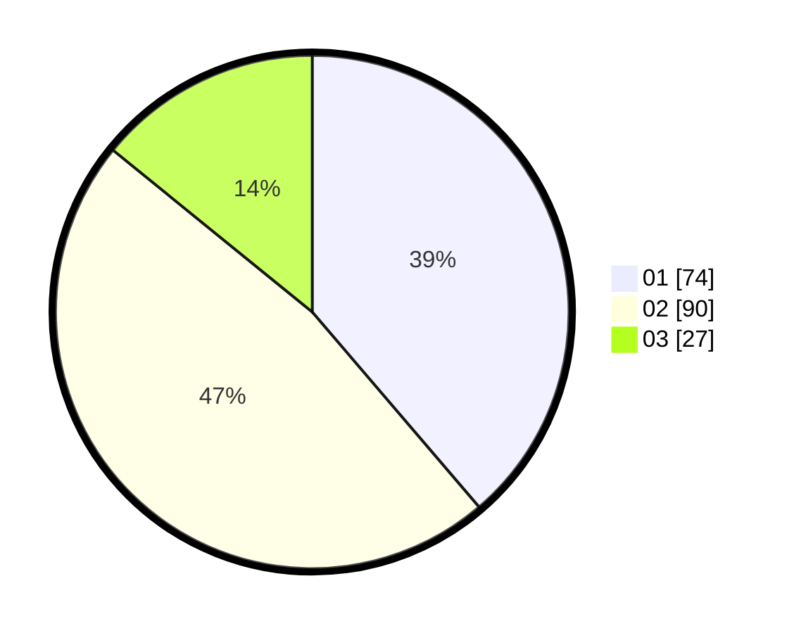

# Hasil

Hasil perolehan suara paslon dapat dilihat pada file paslon-01.txt, paslon-02.txt, dan paslon-03.txt.

Jika tidak ada, artinya data tersebut belum ada pada SIREKAP.

## Perolehan Suara

 * Paslon 01: **74**.
 * Paslon 02: **90**.
 * Paslon 03: **27**.

## Foto C Plano

https://sirekap-obj-formc.kpu.go.id/ec03/pemilu/ppwp/31/73/01/10/01/3173011001064-20240214-233311--3645d84a-4bb8-4e14-afbb-1db5103b8c53.jpg

https://sirekap-obj-formc.kpu.go.id/ec03/pemilu/ppwp/31/73/01/10/01/3173011001064-20240214-233406--05e6c2a0-4988-40d4-ad48-8613bb34a71f.jpg

https://sirekap-obj-formc.kpu.go.id/ec03/pemilu/ppwp/31/73/01/10/01/3173011001064-20240214-233447--96779c87-2e4d-4e34-8408-96dc706f8d45.jpg
