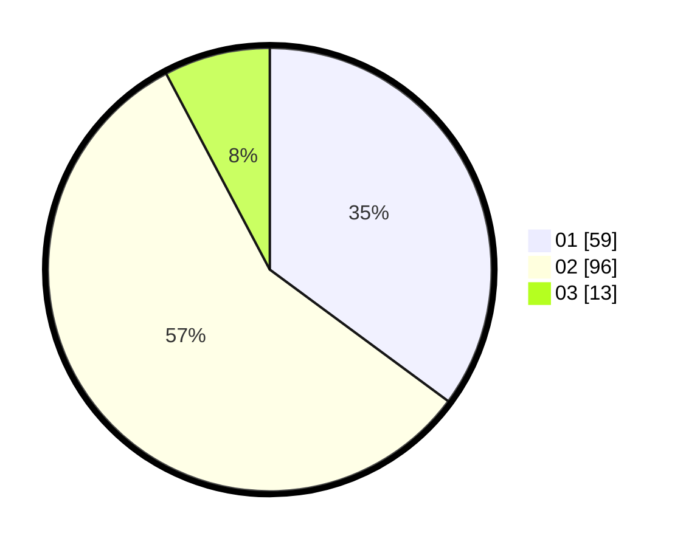

# Hasil

Hasil perolehan suara paslon dapat dilihat pada file paslon-01.txt, paslon-02.txt, dan paslon-03.txt.

Jika tidak ada, artinya data tersebut belum ada pada SIREKAP.

## Perolehan Suara

 * Paslon 01: **59**.
 * Paslon 02: **96**.
 * Paslon 03: **13**.

## Foto C Plano

https://sirekap-obj-formc.kpu.go.id/fdfb/pemilu/ppwp/31/73/01/10/01/3173011001065-20240214-155153--5e5b76dd-082f-4936-8f1e-6aaf14e9c583.jpg

https://sirekap-obj-formc.kpu.go.id/fdfb/pemilu/ppwp/31/73/01/10/01/3173011001065-20240214-155026--5c50d4a4-8eb3-4794-8009-f7f895c6300f.jpg

https://sirekap-obj-formc.kpu.go.id/fdfb/pemilu/ppwp/31/73/01/10/01/3173011001065-20240214-155341--af92d14b-532b-4c16-a349-a416b8f5f183.jpg

## DATA PEMILIH TETAP

Jumlah pemilih dalam DPT: **214**.
 * L: **103**.
 * P: **111**.

## DATA PENGGUNA HAK PILIH

Jumlah pengguna hak pilih dalam DPT: **169**.
 * L: **81**.
 * P: **88**.

Jumlah pengguna hak pilih dalam DPTb: **0**.
 * L: **0**.
 * P: **0**.

Jumlah pengguna hak pilih dalam DPK: **2**.
 * L: **0**.
 * P: **2**.

Jumlah pengguna hak pilih: **171**.
 * L: **81**.
 * P: **90**.

## JUMLAH SUARA SAH DAN TIDAK SAH

JUMLAH SELURUH SUARA SAH: **168**.

JUMLAH SUARA TIDAK SAH: **3**.

JUMLAH SELURUH SUARA SAH DAN SUARA TIDAK SAH: **171**.
